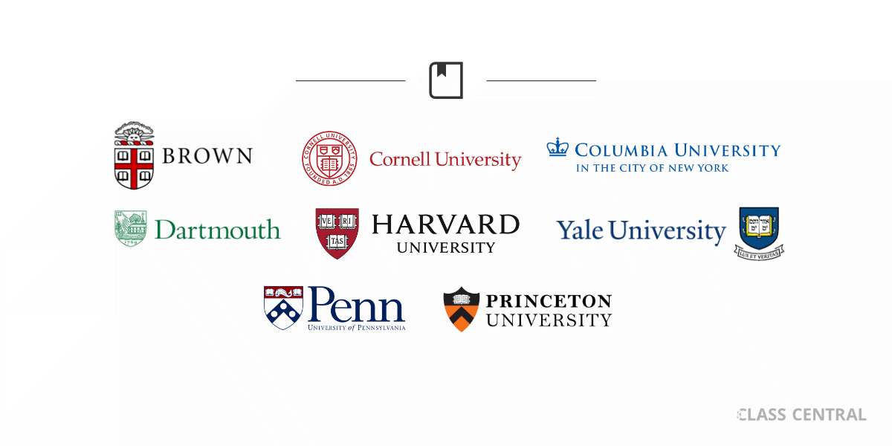
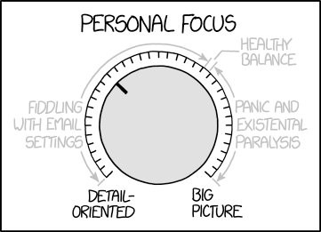
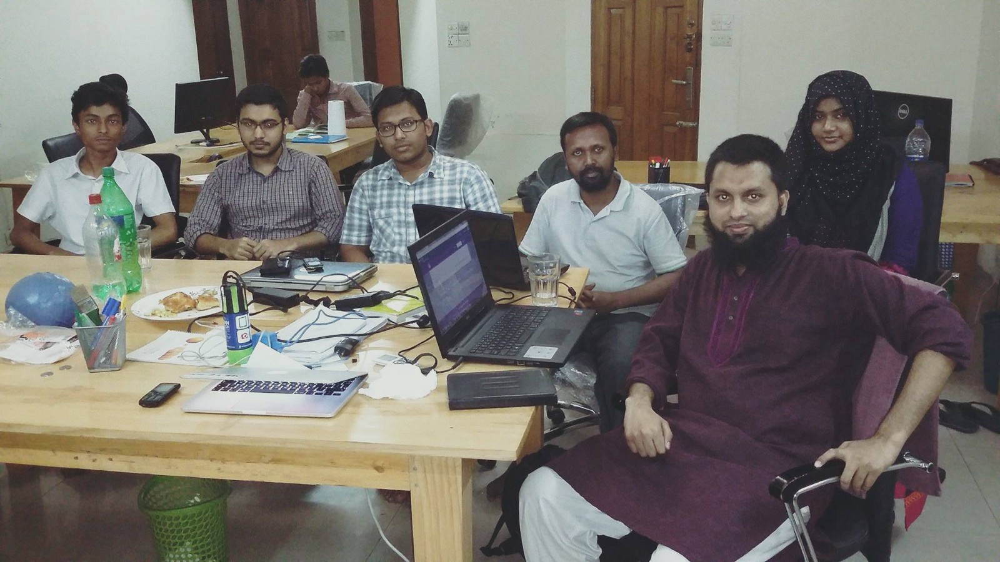

Here are three links worth your time:

1.  Here are 250 Ivy League courses you can take online right now for free ([13 minute read](http://bit.ly/2k3vnfS))
2.  The world through the eyes of a self-driving car ([5 minute read](http://bit.ly/2lravMA))
3.  The Met Museum made 375,000 images free ([2 minute read](http://nyti.ms/2lrq5If))

### Thought of the day:

> “There are two major products that come out of Berkeley: LSD and UNIX. We don’t believe this to be a coincidence.” — Jeremy S. Anderson

### Image of the day:

Image credit: [XKCD](http://bit.ly/2ksoIur)

### Study group of the day:

[freeCodeCamp Dhaka](http://bit.ly/2kOyBUo)

Happy coding!

– Quincy Larson, teacher at [freeCodeCamp](http://bit.ly/2j7Q1dN)
