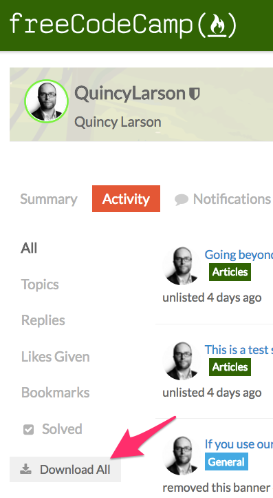

The European Union’s new General Data Protection Regulation (GDPR) is an important step toward protecting your privacy. It gives you more control over your data and how it is used by websites and internet services.

freeCodeCamp doesn’t show you ads or sell your data. Instead, we sustain ourselves through 4,000+ people who donate to our nonprofit each month.

Even so, we still found several opportunities to further improve your privacy.

We’ve added several new features to help you better manage your data:

1.  You can now download all of your freeCodeCamp data in a convenient JSON file from [your settings page](https://www.freecodecamp.org/settings).
2.  We’re making giving you more control over which data you make public through your freeCodeCamp profile. In the past, your profile is either completely private or completely public. Now you can control which sections of your profile are public and which are private.
3.  We’re removing Facebook sign-in and other social sign-in options for privacy reasons. All sign-ins will now be done using your email address. If you sign into freeCodeCamp.org using Facebook sign-in Google sign-in, or other social sign-in methods, we’ll confirm your email. Then use that to sign you in going forward.

Also, we’ve re-written our Privacy Policy and Terms of Service from the ground up to make them as clear and simple as possible.

### Frequently Asked Questions:

#### What will happen to GitHub integration?

In the past, we required you to link your freeCodeCamp account with GitHub as an additional verification step before you could claim your certifications. You will no longer need a GitHub account to do this.

We’re removing GitHub integration completely.

By default, your freeCodeCamp username will be a string of random hexadecimal characters. You can set your name, username, location, and other biographical data to whatever you want it to be, or just leave it blank. You have full control.

#### What about the freeCodeCamp forum?

We use the open source Discourse project to run the freeCodeCamp forum. It’s a completely separate system, with its own accounts, terms of service, and privacy policy.

We are working with the Discourse team to install the latest privacy updates and properly configure the forum to comply with GDPR.

Other than that, we don’t plan to make any major changes to the forum.

You can download your forum data from the “activity” section of your forum settings. Just click the “Download all” and you’ll get a nice zipped .csv file.

####
