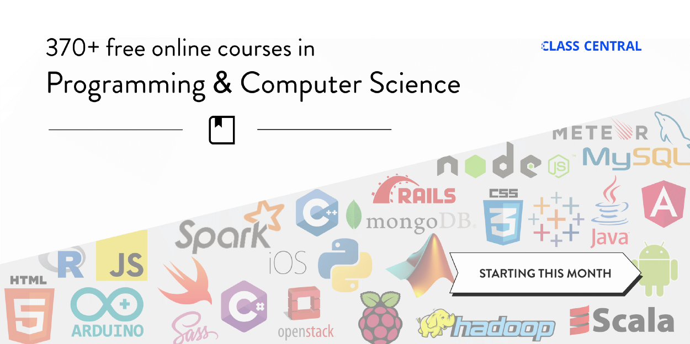
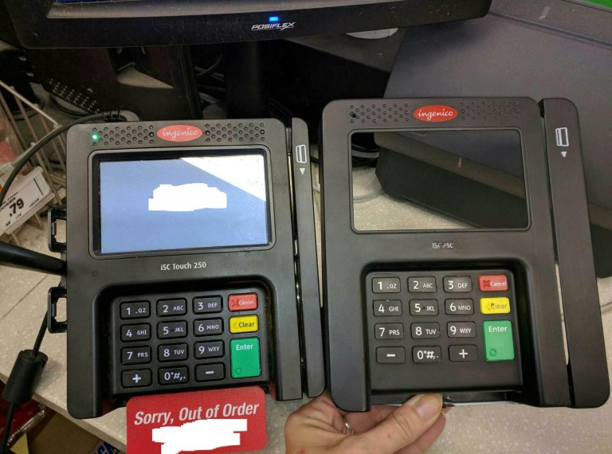
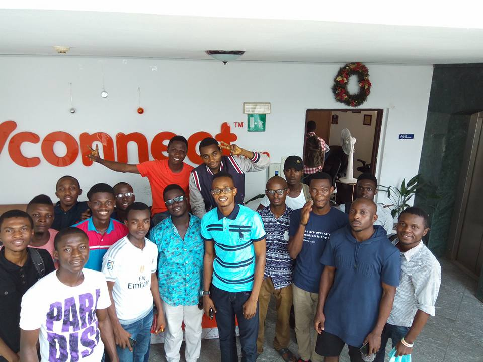

Here are three links worth your time:

1.  370 free online programming and computer science courses you can start in March ([22 minute read](http://bit.ly/2lO5nSC))
2.  A programmer’s guide to unicode ([18 minute read](http://bit.ly/2m8l6gm))
3.  A pixel map generator ([1 minute interactive](http://bit.ly/2lsXfep))

### Thought of the day:

> “It ain’t what you don’t know that gets you into trouble. It’s what you know for sure that just ain’t so.” — Mark Twain

### Image of the day:

A normal credit card payment terminal on the left, a credit card skimmer on the right. These skimmers are planted within stores by thieves and used to steal credit card information —[ sometimes for weeks without being detected](http://bit.ly/2m8hWsM).

### Study group of the day:

[freeCodeCamp Lagos](http://bit.ly/2lt5C9L)

Happy coding!

– Quincy Larson, teacher at [freeCodeCamp](http://bit.ly/2j7Q1dN)
