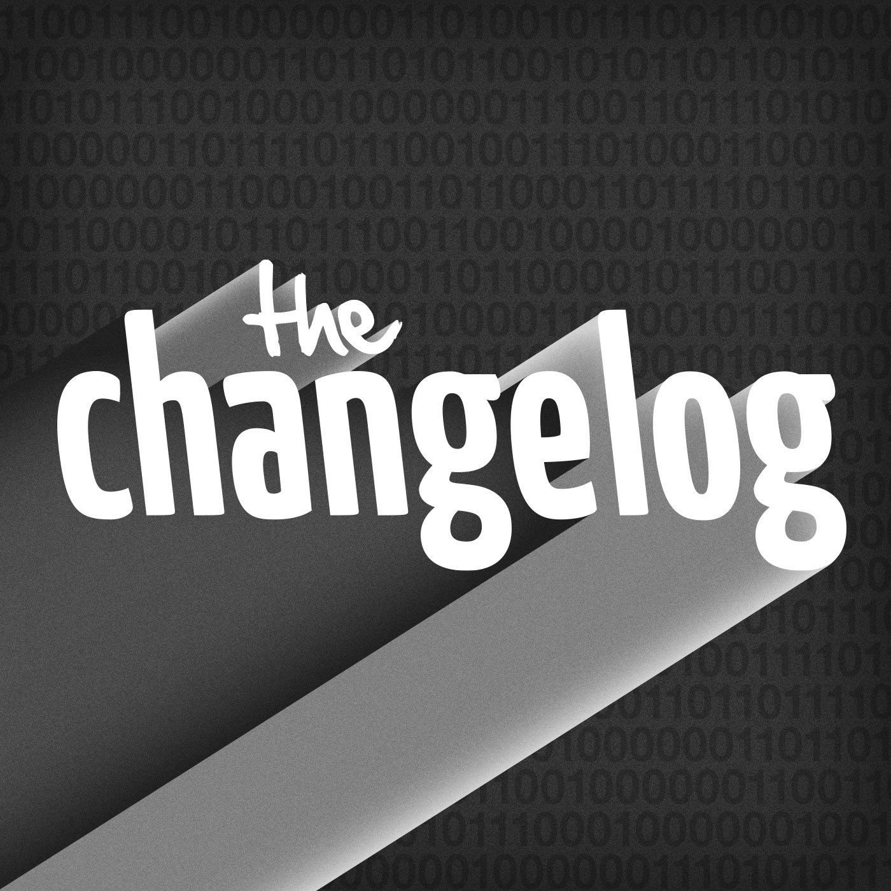
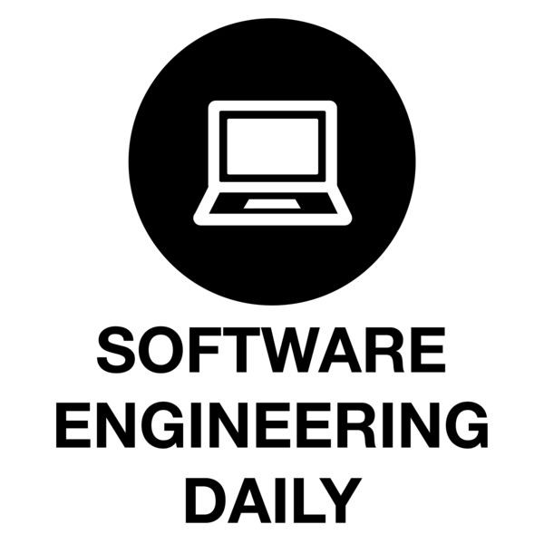
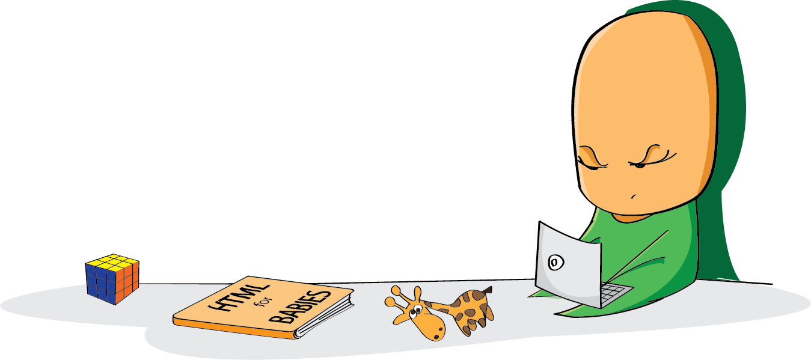
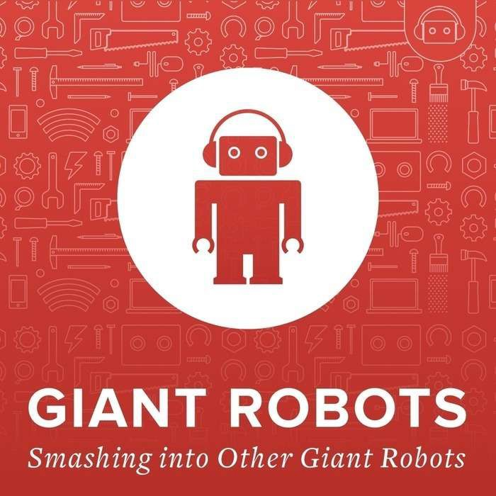
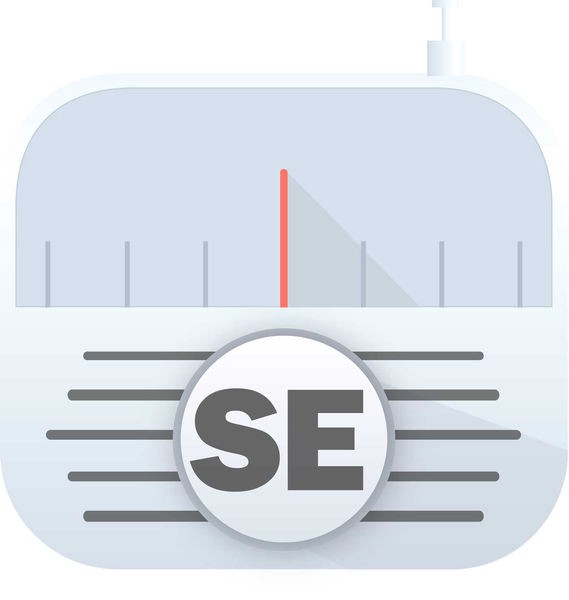

It’s hard to program on the run. Crowded trains, bumpy buses and tiny touch screens don’t make for happy coding.

So how do you as an ambitious coder make more productive use of your daily commute? By listening to podcasts about coding!

Here are 5 coding podcasts that will help you stay up-to-date with the rapidly changing field of software engineering. All without taking your eyes off the road.

#### The Changelog

The Changelog has been going strong since 2009. It features a variety of guests from around the open source world.

The hosts, Adam and Jerod, have very broad technical knowledge. They can come up with thoughtful questions about anything. And they manage to be quite funny in the process, even when they’re delving into the more nitty-gritty details of these projects.

[Subscribe to The Changelog here.](https://changelog.com/podcast/?ref=freecodecamp)

#### Software Engineering Daily

The newest podcast on this list, Software Engineering Daily invites the some of the most influential developers from world to talk about their projects.

Host Jeff Meyerson is a master interviewer, and does plenty of research before every show. He brings out all kinds of deep thoughts from his guests. He also does a good job of keeping the content accessible enough for listeners who are new to coding.

[Subscribe to Software Engineering Daily here.](http://softwareengineeringdaily.com/?ref=freecodecamp)

#### CodeNewbie

If you’re new to coding — or just want to empathize better with your junior developer colleagues — then CodeNewbie is the podcast for you.

Saron Yitbarek brings out humorous stories from a wide variety of coders, with a focus on how they learned (and continue to learn) how to code.

[Subscribe to the CodeNewbie Podcast here.](http://www.codenewbie.org/podcast?ref=freecodecamp)

#### Giant Robots Smashing into Other Giant Robots

Ben Orenstein interviews his colleagues from premier devshop ThoughtBot, along with guests from other areas of development and design.

He doesn’t pull any punches with his interviewees, and isn’t afraid to deep-dive into a topic on a whim.

[Subscribe to Giant Robots Smashing into Other Giant Robots here.](http://giantrobots.fm/?ref=freecodecamp)

#### Software Engineering Radio

Software Engineering Radio is the most technical podcast listed here. It features a variety of hosts, all of whom have strong theoretical foundations in computer science and software engineering.

This podcast doesn’t dumb things down, so you’ll probably find yourself googling terminology afterward. But it’s a great way to get wide exposure to more advanced topics in the field of software development.

[Browse episodes of Software Engineering Radio here.](http://www.se-radio.net/?ref=freecodecamp)

**I only write about programming and technology. If you** [**follow me on Twitter**](https://twitter.com/ossia) **I won’t waste your time. 👍**
