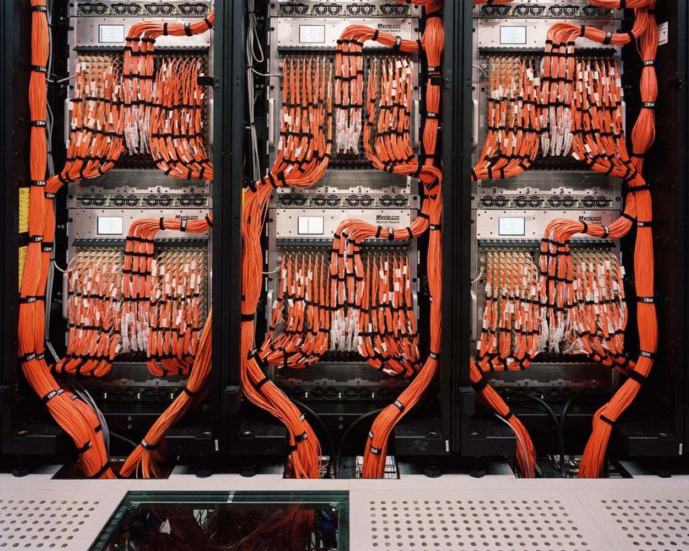
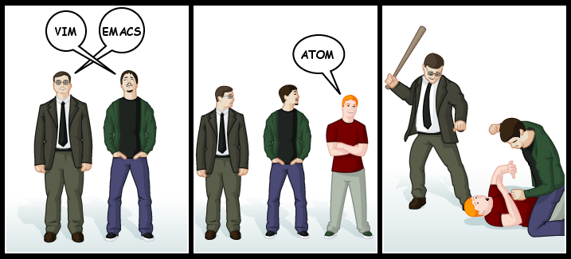

I was just a guy in a suit in an office with a vague startup idea. Then I decided to learn to code.

I overheard some guy at a happy hour bragging about how easily he was able to automate his office workflows by using a language called Ruby. I thought, “huh, Ruby.” I went home, googled it, and within 15 seconds, I was working through a random Ruby tutorial.

A week later, I went to my first hackerspace meeting. Everyone was talking about languages like Scala, Clojure and Go. There was so much to learn. I borrowed three O’reilly books and got about 50 pages into each of them.

A friend told me I should get good at Emacs, and gave me his configuration files. I spent a few hours learning basic Lisp syntax so I could further configure it.

Then some guy walked by and saw me using Emacs. “Why are you using Emacs?” he asked me. “Don’t you know Vim is better?” “Hm. Vim.” So I started memorizing dozens of Vim keyboard shortcuts.

At the time, it seemed reasonable to think that the faster I could type, the faster I could code. I switched to a Programmer’s Dvorak keyboard layout because, hey, it was objectively the most efficient keyboard a programmer could use.

On the days I could actually get my netbook to successfully boot Linux — and that I was able to type more than 10 words per minute — I studied Python by working through books and Udacity courses.

After 7 months of grueling self-study and going to coding events, I landed my first software engineer job.

During my interview with the CTO, I told him about all the tools I’d learned and the esoteric configurations I was using. The CTO nodded and listened politely. And once I’d finished boasting of the breadth of my knowledge, he put me in my place with a single polite observation. He said, “There are many ways you can do most things, but only a few ways that make sense.” With that, he handed me a beat-up MacBook and set me loose in the developer bullpen.

Four years before, the company had decided to build their product using Ruby on Rails. They committed fully to that decision, and much of their original code was still intact. All the engineers used MacBooks, which were both reliable and similar to the Ubuntu Linux servers they used in production.

Instead of arguing over Vim or Emacs, everyone just used RubyMine, a powerful Integrated Development Environment (IDE) with a sensible default configuration. This meant that any one engineer could sit down next to any other engineer and immediately start pair programming on a task without needing to orient themselves to their colleague’s development environment. This fact alone solved much of the awkwardness and unconscious resistance two developers feel when they try to collaborate.

The company was OK with me not knowing Ruby on Rails. Since I’d focused my studies enough to learn some Python and Django and win a hackathon, they took that as a sign that I could eventually learn Rails.

The first few weeks were tough, and not just because I was working with a new team in a new language, framework and codebase. It was tough because everywhere I looked, I saw evidence that I’d gone about learning to code in an absurdly masochistic way.

I’d spent months sitting alone in libraries and cafes, blindly installing tools from the command line, debugging Linux driver problems, and banging my head over things as trivial as missing parenthesis.

I dabbled in every online course program imaginable, and started countless MOOCs. I don’t think I actually got something onto the internet without the guidance of a tutorial until month number five!

This gave me the impression that programming was a Sisyphean struggle. I was convinced that the seemingly normal programmers I ran into were actually sociopaths who had experienced, then repressed, the trauma of learning to code.

Contrast this with my coworkers, who rarely even encountered syntax errors because their IDEs caught them first. My coworkers’ MacBooks just worked. If they got an error message and couldn’t solve it with a few minutes of reading and googling, they’d simply instant message one another for help debugging it. They’d hop over to one another’s desks and casually pair program.

There wasn’t much ego or elitism. There wasn’t the feeling that programming was a grind. It was just a series of constructive conversations between friendly adults, several of whom had learned to code on their own like I had.

The team was committed to their tools. Aside from Passion Project days and hackathons where developers could experiment with new JavaScript frameworks like Angular.js, they mostly focused on getting better with their current technology. They were conservative about what they allowed into their codebase.

You see this same ethos at places like [ThoughtBot](http://playbook.thoughtbot.com/), where everybody sticks with a small but effective tool chain (in their case, Rails, Vim, Postgres and Redis). By focusing on a few key tools, their engineers become experts who can easily interoperate.

So the real questions is, if highly productive teams of software engineers work best with a focused set of tools, couldn’t people learning to program also learn best with a focused set of tools? Online coding curricula and coding bootcamps certainly seem to think so.

But as an individual, with so many options out there, it’s really hard to decide what to learn. I know because I was that dog circling around an intersection, chasing one car after another. A good programmer’s skill set can be described as T-shaped, with shallow knowledge in many areas, but deep knowledge in at least one. But after months of stress and hard work, I was shaped more like an underscore.

For each person I’ve met who started out learning this way — and I’ve met many — there are probably countless people who started out this way, got discouraged, and gave up their dreams of being a programmer. I don’t want this to happen to you.

### You need to focus

Without further ado, here the big mistakes I see new coders make all the time:

-   Switching languages or frameworks frequently, or deluding themselves into thinking they can become proficient in all of them.
-   Personalizing their development environment with exotic tools, rather than more conventional tools that can be reliably used while collaborating with others.
-   Trying to learn tools like Docker and Famo.us because they’re new and exciting, even though they haven’t yet mastered more fundamental technologies.

If I had to summarize my do-as-I-say-not-as-did advice in one word, it would be: **focus**.

My question to you is: would you describe your plans for learning to code as focused? If you feel your plans are focused, you should stop reading now and get back to studying, because I don’t want to say something that might cause you to lose focus. If you haven’t focused your plans for learning to code yet, I have good news — you can do this right now. But it will take a few minutes and involve making some hard decisions. Wait! Don’t leaaaaave… Oh, good. You’re still here. OK, here are the decisions you need to make:

1.  Choose **one** type of software development that interests you enough to define your career: web, mobile, gaming or embedded. I recommend web because it’s flexible. There are a ton of jobs and a ton of learning resources. If you’re passionate about something other than web development, leave this blog post and google search “getting started in \_\_\_\_\_ development” and go all-in on it!
2.  Choose **one** language to learn: JavaScript, Ruby, or Python. Each has its strengths. Each has tools that can be used to build web apps (Node.js, Rails, and Django respectively). Unless you already have a strong preference, I recommend JavaScript because it’s the most popular language.
3.  Choose **one** online curriculum to study. If you’re learning JavaScript, [freeCodeCamp.org](http://freecodecamp.com/) has a comprehensive one. Trust the wisdom of the teachers who designed the curriculum you’ve chosen, and work through it in the recommended order, without skipping around.

Once you’ve made these decisions, the path forward is simple. Keep your sanity by ignoring the hype surrounding new tools. Keep your momentum by working through your chosen curriculum seven days a week, even if it’s only for half an hour at a time. Keep your confidence by trusting the judgement you made with today’s decisions.

And remember: with patience, any able-minded person can become a great coder, and that includes you.

**I only write about programming and technology. If you** [**follow me on Twitter**](https://twitter.com/ossia) **I won’t waste your time. 👍**
