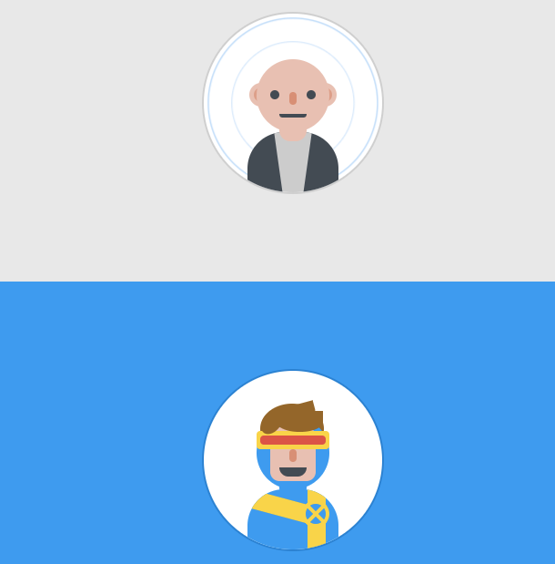
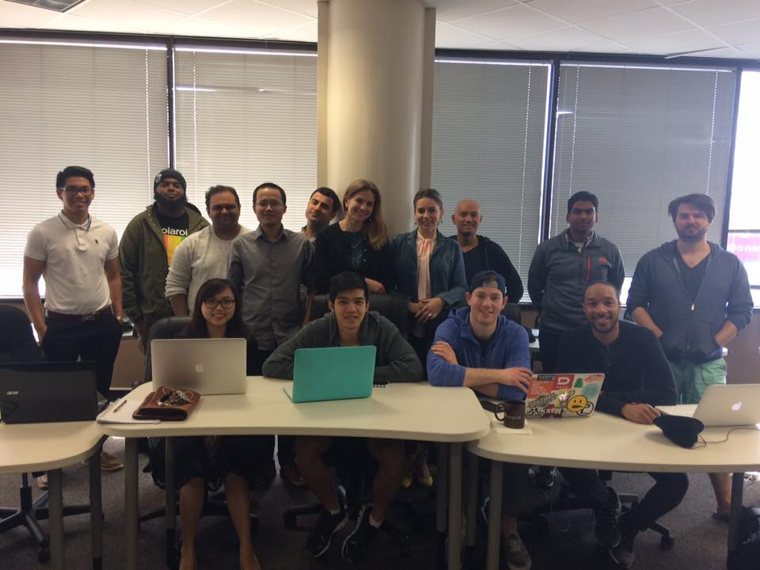

Here are three links worth your time:

1.  A designer drew 8 iconic X-Men using nothing but CSS ([1 minute interactive](http://bit.ly/2npANQr))
2.  Raspberry Pi just turned 5. Here’s a brief history of the world’s tiniest hobbyist computer. ([5 minute read](http://bit.ly/2nkmYpE))
3.  A chatbot that overturned 160,000 parking fines is now helping refugees claim asylum ([3 minute read](http://bit.ly/2npzz7X))

### Thought of the day:

> “History shows a typical progression of information technologies, from somebody’s hobby to somebody’s industry; from jury-rigged contraption to slick production marvel; from a freely accessible channel to one strictly controlled by a single corporation or cartel — from open to closed system.” — Tim Wu

### Funny of the day:

### Study group of the day:

[freeCodeCamp Dallas](http://bit.ly/2nBE1ja)

Happy coding!

– Quincy Larson, teacher at [freeCodeCamp](http://bit.ly/2j7Q1dN)
