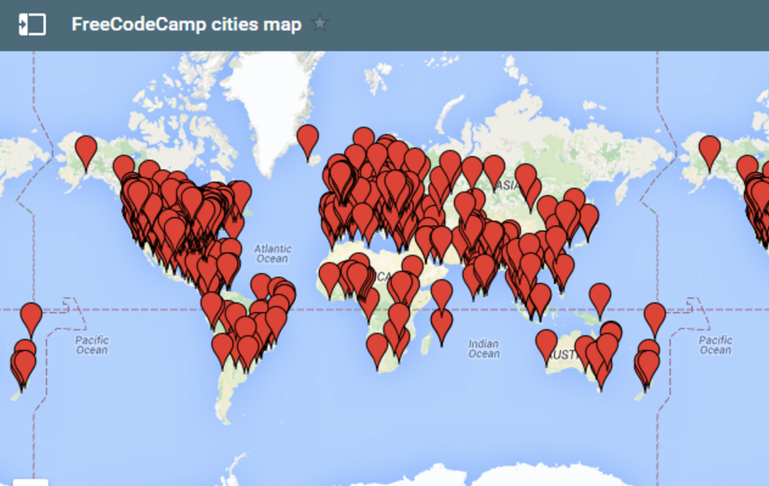
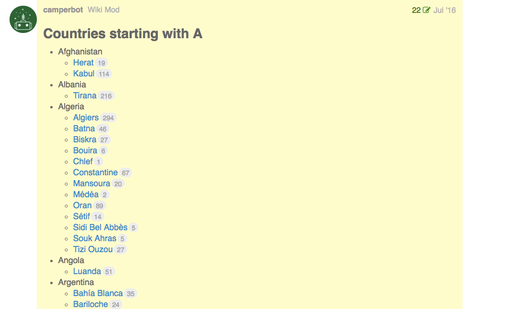
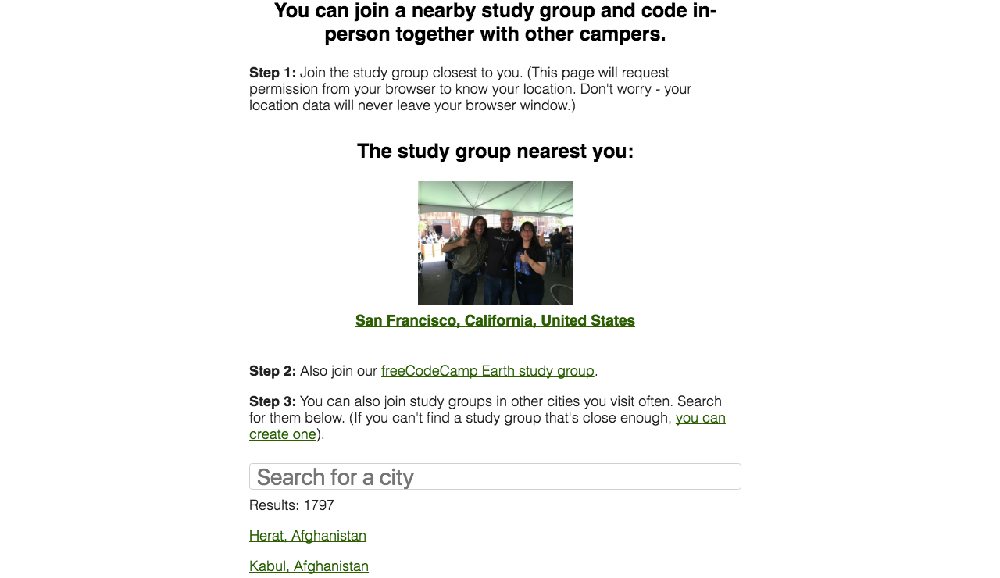
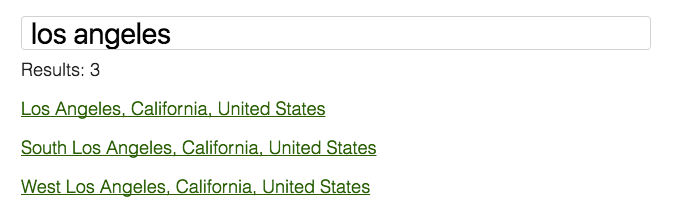

 campers meeting for one of their weekly coding sessions.](./asset-1.jpeg)

Our open source community now has study groups in almost every major city on earth — 1,800 of them.

With so many study groups, exploring them used to be inconvenient. You had to scroll through a list of posts on our forum.

Well today, I’m thrilled to announce a much simpler way to find study groups in your city.

Introducing our new [study group directory](https://www.freecodecamp.com/study-group-directory).

Here’s what it currently looks like:

Our directory will automatically show you the study group that’s closest to you. You can also search by city, state/province, and country.

Some major cities have several study groups to choose from:

](./asset-6.jpeg)

Most freeCodeCamp study groups are organized around Facebook groups. (Facebook groups are free, and since most people have Facebook accounts, they’re easy to join.) We also have groups on MeetUp and WeChat.

Each study group is run [fully autonomously](https://medium.freecodecamp.com/free-code-camps-1-000-study-groups-are-now-fully-autonomous-d40a3660e292#.q0syjv8zs). They can make their own decisions about where to meet and what to do. Some of them meet in cafes or libraries. Others have made arrangements with local schools, companies, or governments to set up designated venues.

](./asset-7.jpeg)

It takes effort to achieve a consistent turnout at these events. If your city’s group isn’t yet meeting every week, I recommend starting small with [coffee-and-code events](https://medium.freecodecamp.com/jump-start-your-local-campsite-with-coffee-and-code-a8d1a57d30e). It’s [all about consistency](https://medium.freecodecamp.com/i-hosted-40-coding-events-last-year-heres-what-i-learned-94d607cd04f4).

](./asset-8.jpeg)

If you’re interested in taking your city’s study group to the next level, I recommend reading these articles:

[**Free Code Camp’s 1,000+ study groups are now fully autonomous**  
_When the first local Free Code Camp (FCC) study group popped up, we had no idea that within less than a year, nearly…_medium.freecodecamp.com](https://medium.freecodecamp.com/free-code-camps-1-000-study-groups-are-now-fully-autonomous-d40a3660e292 "https://medium.freecodecamp.com/free-code-camps-1-000-study-groups-are-now-fully-autonomous-d40a3660e292")

[**How Free Code Camp keeps me grounded as a recent bootcamp grad**  
_The past year was insane. Yeah, I transitioned from truck driving into a full time junior developer role. But this isn…_medium.freecodecamp.com](https://medium.freecodecamp.com/how-free-code-camp-keeps-me-grounded-as-a-bootcamp-grad-fc08f880371 "https://medium.freecodecamp.com/how-free-code-camp-keeps-me-grounded-as-a-bootcamp-grad-fc08f880371")

[**I hosted 40 coding events last year. Here’s what I learned.**  
_Here are three links worth your time:_medium.freecodecamp.com](https://medium.freecodecamp.com/i-hosted-40-coding-events-last-year-heres-what-i-learned-94d607cd04f4 "https://medium.freecodecamp.com/i-hosted-40-coding-events-last-year-heres-what-i-learned-94d607cd04f4")

### How we built the study group directory app

Our study group directory app is a simple single-page static web app that runs on GitHub Pages. This way, we can easily add new study groups and instantly deploy improvements to the code.

[William McDonald](https://twitter.com/ginoskotheon) — a teacher and developer based in San Antonio, Texas — built this app and maintains it.

Like everything we do, it’s [entirely open source](https://github.com/freeCodeCamp/study-group-directory).

If you happen to run an organization, and you want a directory like this for all your local chapters, feel free to use this.

We welcome your [issues and pull requests](https://github.com/freeCodeCamp/study-group-directory/issues). 😉

Thanks for reading. I hope you make it out to a study group event this month. Happy coding!
