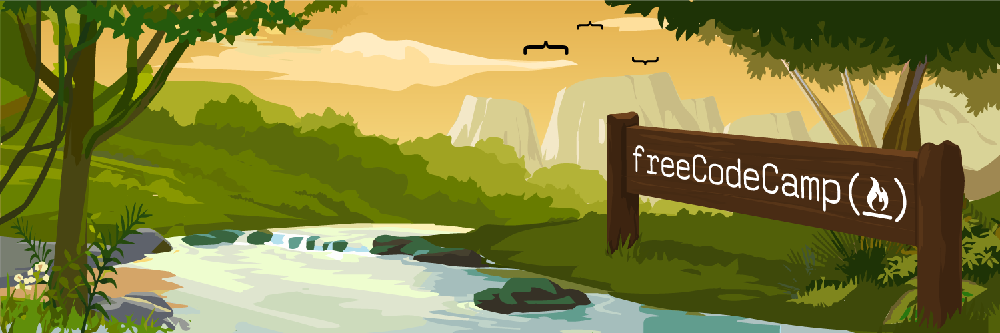
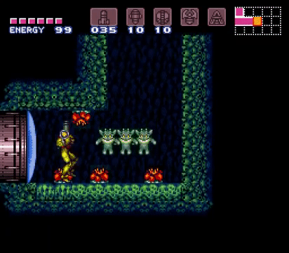

Free Code Camp offers 1,200 hours of interactive coding challenges. These are 100% focused on the practical skill of building software. You code the entire time. You learn to code by coding.

If you want to learn theory, take some of the thousands of [free online university courses](https://medium.freecodecamp.com/the-data-dont-lie-here-are-the-50-best-free-online-university-courses-of-all-time-b2d9a64edfac#.hvt9i2z2c). If you want to actually get good at programming and build apps, go through Free Code Camp.

With that practical focus in mind, let’s talk about the instructional design principles behind our coding challenges.

#### Most people prefer doing to watching or reading.

Videos are great for entertaining people. They are less great for teaching people. About 70% of people will watch a video for [up to 2 minutes](https://wistia.com/blog/optimal-video-length), but rapidly lose interest after that.

There are other problems with video: it requires a lot of bandwidth. It also requires people to put on their headphones if they’re in a public place, and to stop their music if they’re already wearing headphones.

Text is extremely accessible, but it suffers from the same attention span problems. “[People don’t read](http://www.slate.com/articles/technology/technology/2013/06/how_people_read_online_why_you_won_t_finish_this_article.single.html)” is one of the core tenants of user experience design. The less text you use, the more likely people will read to the end.

But people love interacting. They absorb themselves in interactive tasks like writing, playing musical instruments, or programming. Time melts away. They achieve a [flow state](https://en.wikipedia.org/wiki/Flow_%28psychology%29). They are able to get into the zone in a way they couldn’t if they had to frequently stop to un-pause a video or find their place on a page.

So why do we see so many video tutorials and books when interactive is the most engaging way for most people to learn? Because teaching concepts interactively is a far more difficult task. These are still the early days of interactive learning, and instructional designers are just beginning to discover ways to facilitate learning while doing.

#### Every concept that can be taught passively can also be taught interactively. It’s just a question of how.

The best example is to look at video game onboarding. A good game will 

  

Rules for creating challenges

  

#### The two minute rule

All challenges should be solvable — by a native English speaker who has completed the previous challenges — within 120 seconds. This includes the amount of time to read the directions and code, write their own code, and get all the tests to pass. 

If it takes longer than two minutes, break the challenge down into two or more simpler challenges.

This is the one rule of challenge creation. It forces your directions to be concise, your seed code to be clear, and your tests to be straight-forward.

We have JavaScript events that track how long it takes for campers to solve challenges.

  

#### How to name challenges

Naming things is hard. So let’s make it easier by imposing some constraints. All challenge should be explicit and should follow this pattern:

\[verb\] \[direct object\] \[indirect object\]

Here are some examples:

-   “Use Clockwise Notation to Specify the Padding of an Element”
-   “Condense arrays with .reduce”
-   “Use Bracket Notation to Find the First Character in a String”

  

#### Writing tests

Challenges should have the minimum number of tests necessary to verify that a camper understands a concept.

  

  

  

  

  

The 22 year old game Super Metroid. Half way into the game, you encounter a room with walls too high for you to jump. But luckily, there are three cute creatures there. They show you that it’s actually possible to bounce from one wall to the next. It’s always been possible. You just didn’t know it was possible, and didn’t need to know it until this moment.

This is a teachable moment. You put the learner in a situation that forces them to expand their knowledge. Then you figure out a mechanic through which you can show them how, without explicitly telling them the answer. 

  

> “Talk is cheap. Show me the code.” — Linus Torvalds

  

#### Each challenge should cover exactly one concept.

By keeping challenges short and focused, you eliminate the
