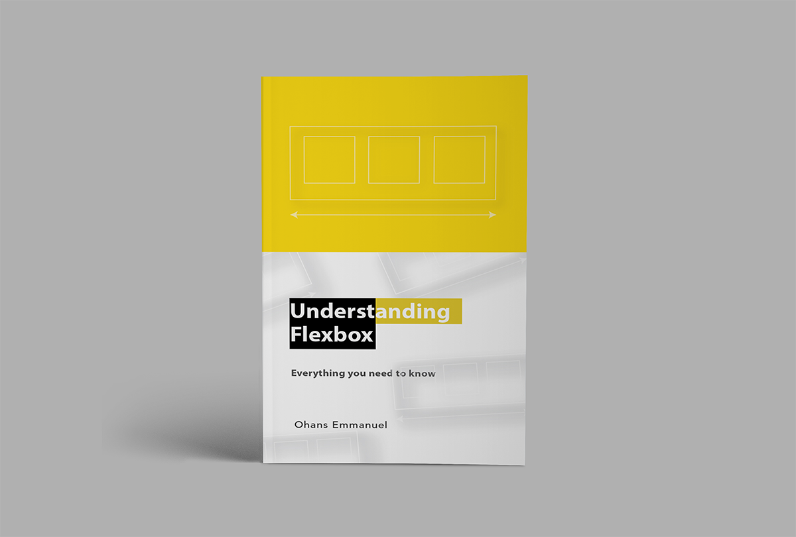

Here are three stories we published this week that are worth your time:

1.  Understanding Flexbox: Everything you need to know: [46 minute read](http://bit.ly/2jewbKR)
2.  10 podcasts that new coders should listen to in 2017: [5 minute read](http://bit.ly/2j1fFjV)
3.  What I’ve learned from 18 weeks of vlogging my coding journey: [10 minute read](http://bit.ly/2iB8fRg)

Bonus: It’s getting cold out there! So pick up a toasty Free Code Camp hoodie today [in our shop](http://bit.ly/2b099sb).

Happy coding,

Quincy Larson, teacher at freeCodeCamp
