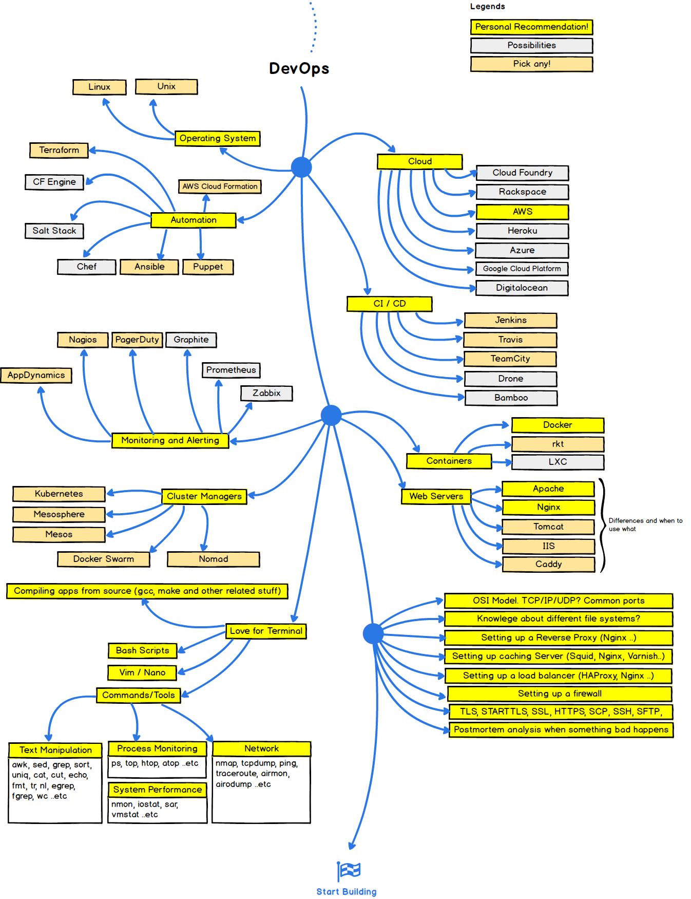

These charts were created by GitHub user [Kamranahmedse](http://bit.ly/2oLBJRO). They visualize three roadmaps to becoming a web developer.

Even though I disagree with some of his suggestions (I recommend you starting building projects almost immediately — and you will with [freeCodeCamp’s curriculum](http://bit.ly/2onlMic)), I still think this is worth reading. It will give you a birds-eye view of the modern tools that web developers use.

Here’s his chart for front-end development:

And for back-end development:

And for DevOps, which he views as an extension of back-end development:

Don’t be intimidated by all this. [freeCodeCamp will teach you many of these web development tools for free](https://www.freecodecamp.com). And you’ll build dozens of projects — and contribute to open source — in the process.

I encourage you to make use of all the awesome free resources out there on the internet. And if you’re looking for a solid core curriculum, [we’ve got you covered](https://www.freecodecamp.com).

**I only write about programming and technology. If you** [**follow me on Twitter**](https://twitter.com/ossia) **I won’t waste your time. 👍**
