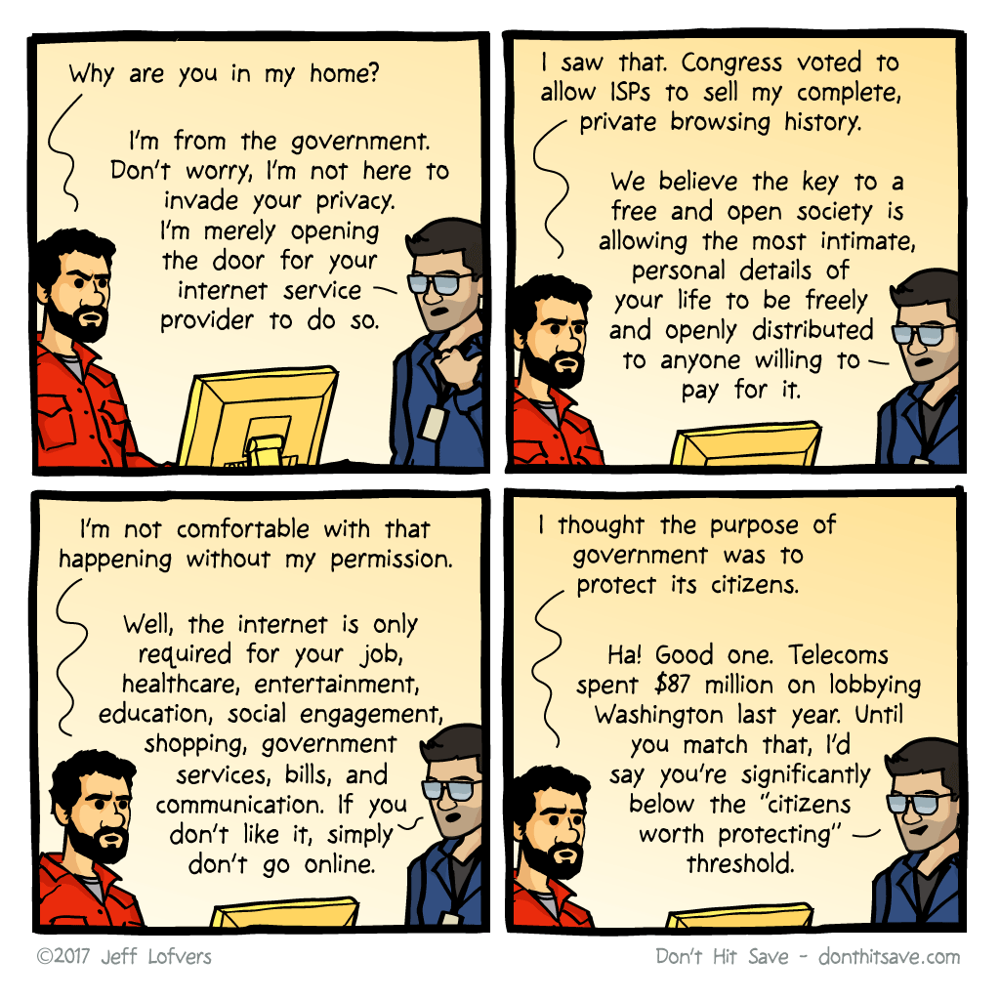

_Note: An earlier version of this story linked to an Electronic Frontier Foundation article about Verizon adding spyware to their Android phones. That article has been retracted while the EFF investigates it further. Please disregard it._

Here are three links worth your time:

1.  A step-by-step guide to building a simple chess AI ([5 minute read](http://bit.ly/2ojhyMi))
2.  How I helped my partner learn to code ([7 minute read](http://bit.ly/2nIONHg))
3.  Software Engineering Daily interviewed me about the importance of Net Neutrality and the Open Internet ([50 minute listen with full transcript](http://bit.ly/2ocXDi6))

### Thought of the day:

> “Relying on the government to protect your privacy is like asking a peeping tom to install your window blinds.” — John Perry Barlow

### (Not so) Funny of the day:

Webcomic by [Don’t Hit Save](http://bit.ly/2oH6HYH)

### Study group of the day:

[freeCodeCamp Melbourne](http://bit.ly/2kC9Kk4)

Happy coding!

– Quincy Larson, teacher at [freeCodeCamp](http://bit.ly/2j7Q1dN)

If you got value out of this email, consider [supporting our nonprofit](http://bit.ly/donate-to-fcc).
