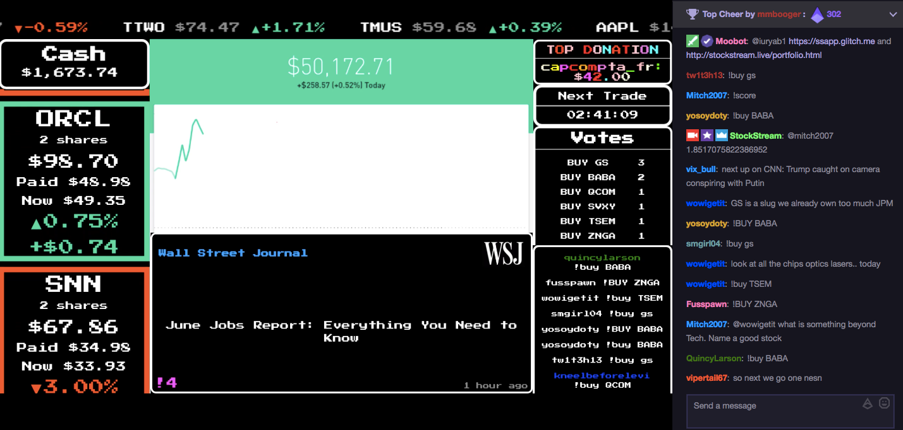
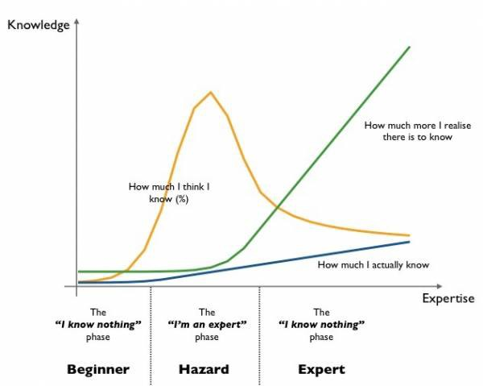
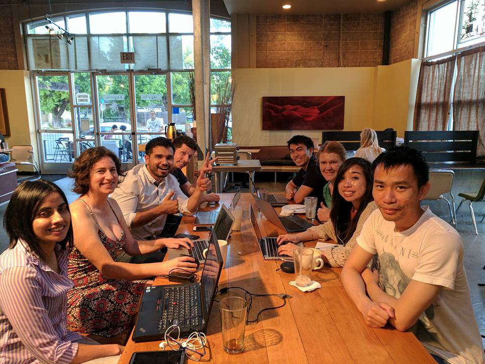

An Amazon engineer built a real-time multiplayer game called [StockStream](https://fcc.im/2tpeJus), where strangers invest $50,000 of his real-life money in the stock market.

Here’s how it works:

-   Anyone can join [the Twitch channel](https://fcc.im/2tybyyW) and vote to buy or sell stocks by typing commands like `!buy APPL` into the chat room
-   Every five minutes, the game will execute the one transaction that the most players voted for during that period
-   The game tracks which players voted for which transactions, and uses the short term capital gains to calculate high scores.

So far, the portfolio has fluctuated around its initial $50,000. Some players have topped up the fund by donating money to it.

The game also has a stock ticker, stock market news updates, and plenty of statistics — all rendered in 8-bit colors and fonts.

A social experiment like this was only recently possible, thanks to two key technologies:

1.  A live-stream + chat platform like Twitch, where players can collaborate by voting on actions (a concept first proven through [Twitch Plays Pokémon](https://fcc.im/2tppEnS))
2.  A zero-transaction-cost stock trading platform like Robinhood

Robinhood is different from traditional stock trading tools in that it doesn’t charge any transaction fees. Traditionally, if you wanted to buy or sell a stock, you would need to pay a broker fee of anywhere between $5 and $30 just to make that transaction.

At 90 transactions per day, the StockStream fund would lose at least $450 per day just to transaction costs.

But since Robinhood makes its money off of interest on your uninvested cash balance, they don’t charge any transaction fees. This means you can trade as frequently as you want without eroding your balance.

StockStream is live throughout New York Stock Exchange trading hours (9:30 a.m. to 4 p.m. Eastern Time).

You can watch the stream, and vote for which stocks to buy and sell [here](https://fcc.im/2tybyyW). It also has a nice soundtrack to code to.

### Here are three other links worth your time:

1.  When should we ignore criticism? ([4 minute read](https://fcc.im/2uyoLaZ))
2.  A day at the office: Reji shows us how he collaborates with developers and designers to build a finance education app for kids ([12 minute watch](https://fcc.im/2sUEWxg))
3.  How to write beautiful Node.js APIs using async/await and the Firebase Database ([3 minute read](https://fcc.im/2tPE55O))

### Thought of the day:

> “We can only see a short distance ahead, but we can see plenty there that needs to be done.” — Alan Turing

### Image of the day:

Chart by [swardley](https://medium.com/@swardley)

### Study group of the day:

[freeCodeCamp Sacramento](https://fcc.im/2sOuw7u)

Happy coding!

– Quincy Larson, teacher at [freeCodeCamp](https://fcc.im/2uyMKqG)

If you get value out of these emails, please consider [supporting our nonprofit](http://bit.ly/donate-to-fcc).
