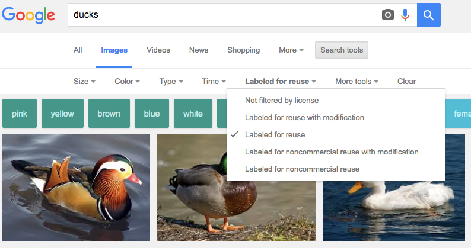
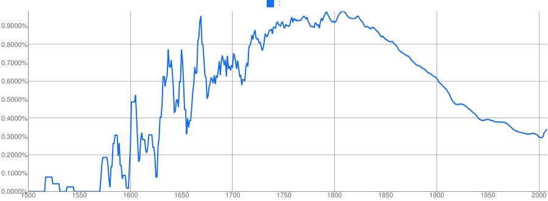

After spending more than 1,000 hours writing and editing stories for our Medium publication, I’ve decided to create this living style guide for contributors. Feel free to use it for your publication as well.

### Headlines

These are the most important part of your story, and you should put some serious thought into them.

Don’t use clickbait:

“You won’t believe this one ridiculously effective headline dark pattern”

Don’t use listicles:

“11 outrageous headlines that will compel people to read your Medium story”

Do tell the truth:

“Clever but matter-of-fact headline about an interesting topic”

Don’t label stories that are part 1 of a series “part 1.” It scares people off, as they will perceive reading it to be a bigger time commitment. And who knows when you’ll get around to writing part 2, anyway.

Also, if your headline is too long, Medium will truncate it. Long headlines can also prevent your top image from appearing in news feeds.

### Images

Medium offers four different image widths. Note that these will all look the same on mobile.

Most of the time, you’ll want to stick with column width:

If you have a chart that is hard to read when it’s small, go bigger:

And if you’re really proud of an image, or if it’s chock full of interesting data, go full-bleed:

… and then there’s side straddle. Don’t use this size at all, because it makes the text less comfortable to read.

It’s also awkward when you’re done talking about the photo and your text is still pushed to the side.

Yeah. I’m still stuck over here.

Always include a high-resolution image at the top of a story under your headline. This has the following benefits:

1.  When people share your story on Facebook and Twitter, it will be more prominent in news feeds, making people more likely to click on it.
2.  It will look better in Medium’s own news feeds.
3.  Humans are visual creatures, and click on images.

### Attribution

Technically as a writer, you are liable for copyright infringement, and Medium is not. The simplest way to attribute an image is to put the words “Image credit” below an image, and link this text to its original source.

In some cases, this might not prove enough for an image right holder. In practice, though, most magazines and movie studios have better things to do than send cease and desist letters to people who merely attributed their copyrighted images.

If you’re looking for images you can safely use without permission, check out [Pexels](https://www.pexels.com/), [Unsplash](https://unsplash.com/), or search Google for images labeled for re-use.

Plagiarism — misrepresenting someone else’s writing as your own — is a serious offense in college, and it’s just as serious on Medium. Always attribute quotes to the people who originally said them. If it’s a multi-line quote, you should use Medium’s pull quotes:

> “When you have wit of your own, it’s a pleasure to credit other people for theirs.”   
> ― **Criss Jami**

Note that you should not use pull quotes under any other circumstances, as they make the text harder to read. Resist the temptation to use pull quotes to quote your own story, or to tease something you’re about to say anyway. This is self-aggrandizing and wastes your readers’ time.

### Code

Where possible, code should be in text form rather than images. This makes the code more [accessible to screen readers](https://medium.freecodecamp.com/looking-back-to-what-started-it-all-731ef5424aec), and easier for people to copy and paste. Here’s how you can do this:

[**How to add code blocks to Medium and use embed tools for syntax highlighting**  
_Medium has a hidden shortcut that will turn text plain text…_medium.freecodecamp.com](https://medium.freecodecamp.com/how-to-add-code-to-medium-and-get-syntax-highlighting-d699761a5883 "https://medium.freecodecamp.com/how-to-add-code-to-medium-and-get-syntax-highlighting-d699761a5883")

### Links

Figure out a way to work a link into a sentence. If a link is vital to a story, put it on its own line and press enter. This will create a preview card, like this:

[**How to stand on the shoulders of giants**  
_Conquer Not Invented Here Syndrome, then do something new._medium.freecodecamp.com](https://medium.freecodecamp.com/how-to-stand-on-shoulders-16e8cfbc127b "https://medium.freecodecamp.com/how-to-stand-on-shoulders-16e8cfbc127b")

Underlining text makes it harder to read, so only hyperlink a few words.

Don’t paste URLS directly, like this: [http://www.example.com](https://www.example.com)

Do use their top-level domains if it’s a part of their brand, like [art.com](http://www.example.com).

### Embedding media

You can embed Tweets, YouTube videos, and other media by pasting their URLs into Medium on a new line, then pressing enter.

<Embed src="https://www.youtube.com/embed/kPRA0W1kECg?feature=oembed" aspectRatio={undefined} caption="" />

<Embed src="https://w.soundcloud.com/player/?url=http%3A%2F%2Fapi.soundcloud.com%2Ftracks%2F174743357&show_artwork=true" aspectRatio={undefined} caption="" />

Use these sparingly, since they may distract your reader from finishing your story.

### Acronyms

Don’t use an acronym unless the acronym is more widely understood than what it stands for. For example, HTTP is more widely recognized than Hypertext Transfer Protocol.

If an acronym isn’t already widely understood, and you’re going to refer to it more than a few times, you can define it as an acronym by doing this:

“Let’s break the code down into an [Abstract Syntax Tree](https://en.wikipedia.org/wiki/Abstract_syntax_tree) (AST).”

Here I also linked to the Wikipedia article, for readers’ convenience. Don’t assume people will read these external links, though. You still need to define concepts or illustrate them through example.

Avoid defining an acronym in your opening paragraphs, as it slows your reader down and makes them less likely to continue reading.

Here’s the very short list of technology acronyms that you don’t need to define: API, AJAX, BIOS, CPU, CSS, HTML, HTTPS, LAN, RAM, REST, USB, WWW, XML. For everything else, you should spell it out.

Always spell out short multi-part words like JavaScript and front-end. Don’t shorten them — the brevity isn’t worth the possible confusion.

### Text Formatting

You can use bold or italic — never both — to place emphasis on a few words. These slow the reader down, and should be used sparingly. Don’t use bold or italic on links. These already stand out due to the underline.

Don’t use drop caps. They look elegant in old books, but silly on the web.

If you want to emphasize something, use **bold**. _Italics are harder to read._ Don’t bold hyperlinks — the line underneath them already provides enough emphasis.

Only use one exclamation point, typically only after exclamations like: Golly gee! Hot dog!

Put commas and periods inside quotes, except when it might confuse a reader (like with variable names or book titles).

In some parts of the world, people put spaces before colons, like this : example. Don’t do this.

Use English instead of Latin:

-   Use “for example” instead of “E.G.”
-   Use “that is” instead of “I.E.”
-   Use “note that” instead of “N.B.”
-   Instead of ending lists with “etc.” start them with “like”: “Elvis ate food like bread, peanut butter, and bananas.”

According to Google Books, semicolons have been dying a slow death. Let’s put them out of their misery. Just use a period instead and break clauses into separate sentences.

Use the Oxford Comma when possible. It’s makes things easier, clearer, and prettier to read.

### Style

Use the [Hemingway App](http://www.hemingwayapp.com/). There’s nothing magical about this simple tool, but it will automatically detect widely agreed-upon style issues:

-   passive voice
-   unnecessary adverbs
-   words that have more common equivalents

The Hemingway App will assign a “grade level” for your writing. Even technical stories can pull off a grade level of 6. And they should aspire to.

Most humans are not native English speakers, and the ones who are don’t usually sit around reading Chaucer all day. They want their information accessible and to the point.

Err on the side of breaking long sentences and paragraphs down into shorter ones.

Use contractions. They’ll make your prose seem more conversational. That’s always a plus.

Keep your tense consistent throughout. If you’re talking about something that occurred in past, use past tense.

Refer to your reader as “you” — not “we” or “us.” “We” are not going to do this tutorial, your reader is going to read your tutorial and do it on their own.

Also, **front-end** development (adjective form with a dash) is when you working on the **front end** (noun form with no dash). The same goes with the back end, full stack, and many other compound terms.

### Final advice

Remember that when you publish on Medium, you’re asking thousands of people to give you several minutes of their lives. Don’t take your readers for granted.

Before you publish a story, I recommend you sleep, wake up, then proof-read it again.

If you aren’t a native English speaker and are writing in English, ask a native speaker to proof-read your story before submitting it to a publication.

When you submit your story to a publication, you should expect for editors to actually edit it. Remember that these people spend a lot more time editing stories than you do, and have a more evolved sense of “what works.” But don’t let this stop you from asking questions and correcting any factual inaccuracies they may introduce.

Be wary of publications that publish your story without making any edits. If they didn’t bother editing it (or even reading it?), they probably won’t put much effort into publicizing it, either.

Oh, and don’t open your story with “This was published on my blog at” or “update: this has been posted on Hacker News.” If you choose to add notes like this, put them at the very bottom of your story. People didn’t click through to your story only to be immediately sent away — they came to read your story.

One last thing — if you want to submit a story to Free Code Camp’s Medium publication, email quincy at freecodecamp com and mention bananas in your email.

If you want to learn more about effective writing on Medium, read this:

[**How to write Medium stories people will actually read**  
_More than 30 million people use Medium each month. They come here in search of something worth reading. Something…_medium.freecodecamp.com](https://medium.freecodecamp.com/how-to-write-medium-stories-people-will-actually-read-92e58a27c8d8 "https://medium.freecodecamp.com/how-to-write-medium-stories-people-will-actually-read-92e58a27c8d8")

**I only write about programming and technology. If you** [**follow me on Twitter**](https://twitter.com/ossia) **I won’t waste your time. 👍**
