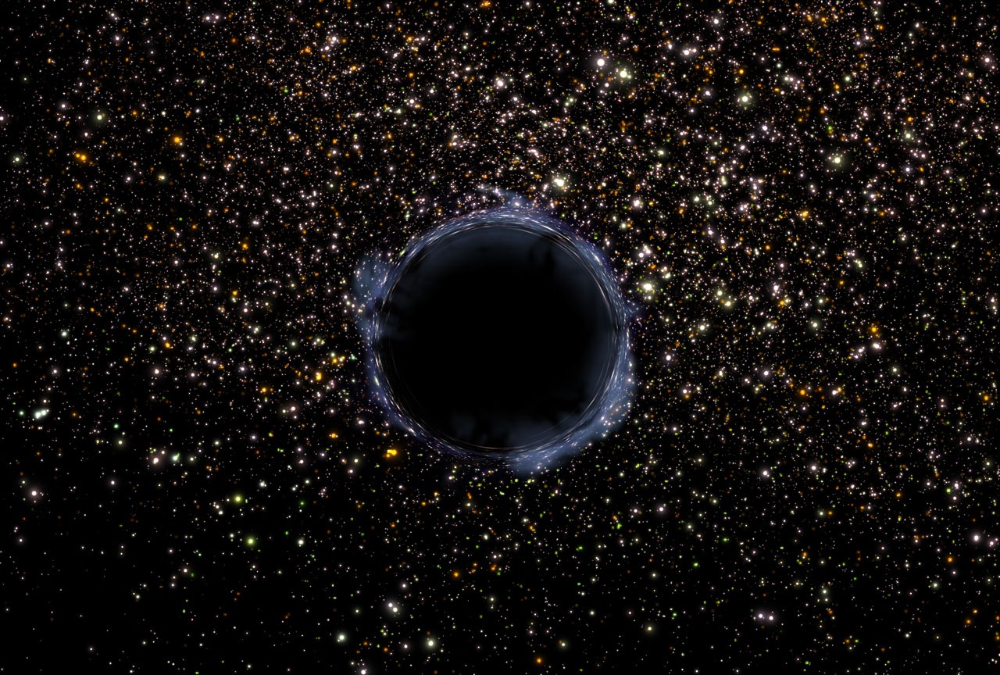

**Within 10⁰ years** your favorite rock star is gonna die.

**Within 10¹ years** your favorite pet is gonna die.

**Within 1o² years** you are gonna die.

**Within 1o³ years** your great-great-great-great-great-great-great-great-great-great-great-great-great-great-great-great-great-great-great-great-great-great-grandkids are gonna die.

**Within 1o⁹ years** Earth is gonna die. The sun will get so hot that it boils our oceans.

**Within 1o¹⁰ years** the  sun is gonna die. The changes in gravity will cause the charred remains of our solar system’s planets to collide with one another. Then they’ll spiral into our dead sun’s white dwarf core.

**Within 1o¹¹ years** the Milky Way is gonna die. It’ll merge with the neighboring galaxy Andromeda, which is gonna die, too. After eons of cosmic violence, their supermassive black hole cores will merge.

**Within 1o¹⁵ years** all stars are gonna die. There won’t be enough matter left to form new stars. It’ll be all used up. We’ll just have black dwarfs, black holes, and radiation. The universe will go black.

**Within 1o³⁰ years** matter is gonna die. Any protons that haven’t been consumed by black holes will start to decay into neutrinos.

**Within 1o¹⁰⁰ years** black holes are gonna die. They’ll evaporate completely. All that’ll be left is radiation.

For all we know, this is a one way trip. There’s no reason to expect that anything will ever exist again. And all that awaits us is absolute-zero blackness.

Lesson’s over. Go outside and play with your kids.
