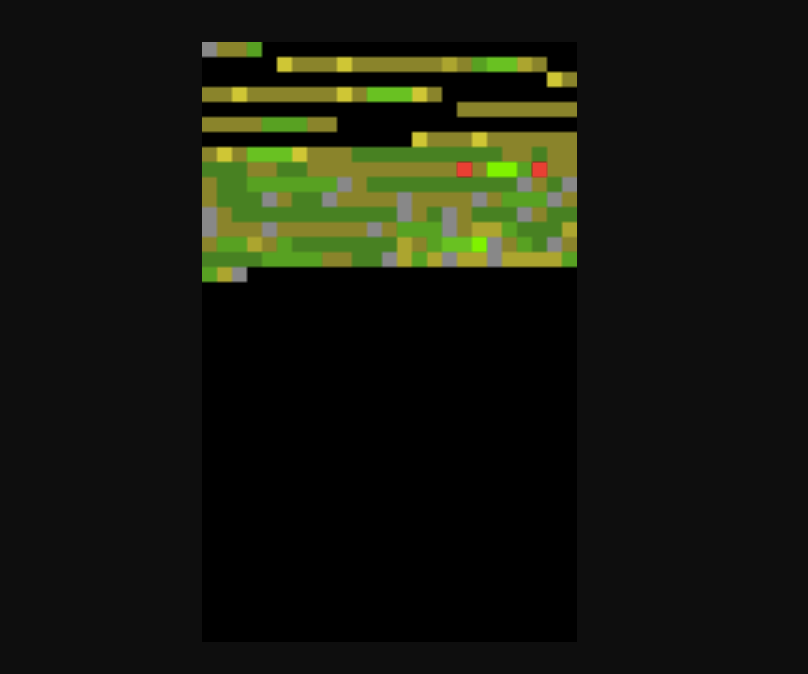
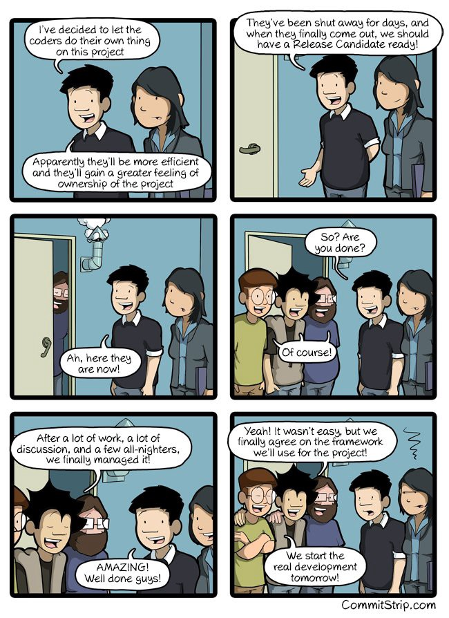

Garbage Collection is the process of cleaning up a computer’s memory by getting rid of data that’s no longer needed by a program. There are several algorithms for doing this. (Black squares represent free memory.)

Here’s a “reference counter” garbage collector:

Here’s a “mark sweep” garbage collector:

Here’s a “copy” garbage collector:

And here’s what happens if you don’t bother with garbage collection until you’re done:

You can read all about these here ([5 minute read](http://bit.ly/2n0Ogyv))

Here are three links worth your time:

1.  Net Neutrality, Walled Gardens, and the future of the the Open Internet ([24 minute read](http://bit.ly/2mNJ9S2))
2.  What are the SOLID principles, and how do they make your code cleaner? ([12 minute watch](http://bit.ly/2nWqJOm))
3.  12 free things you can do to jump-start your UX Design career ([9 minute read](http://bit.ly/2mIuTbC))

### Thought of the day:

> “Securing a computer system has traditionally been a battle of wits: the penetrator tries to find the holes, and the designer tries to close them.” — Gosser

### Funny of the day:

Webcomic by [CommitStrip](http://bit.ly/2nDCeOH).

### Study group of the day:

[freeCodeCamp Washington, D.C.](http://bit.ly/2mIyyWK)

Happy coding!

– Quincy Larson, teacher at [freeCodeCamp](http://bit.ly/2j7Q1dN)
