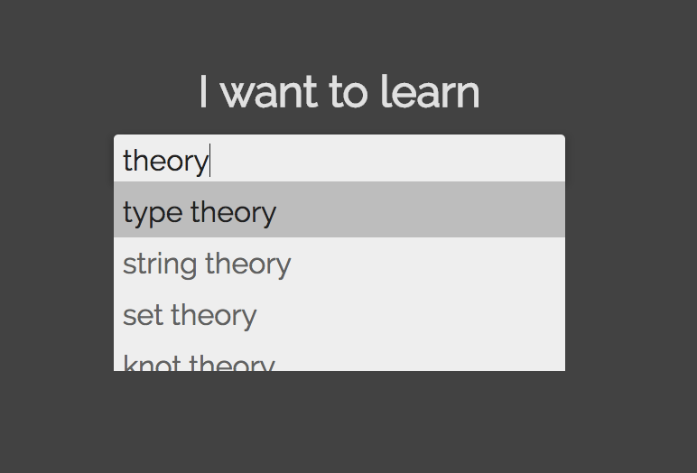
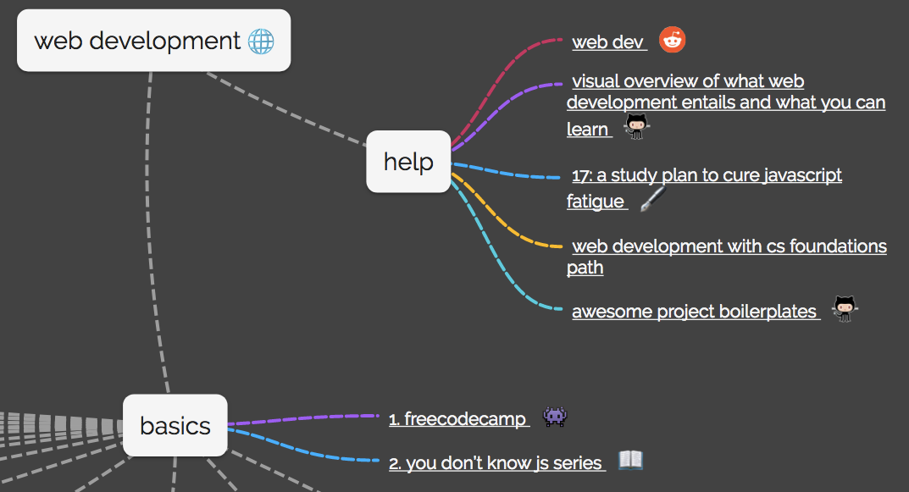
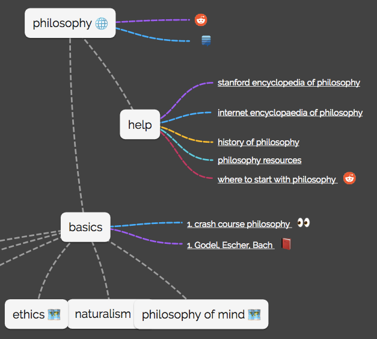
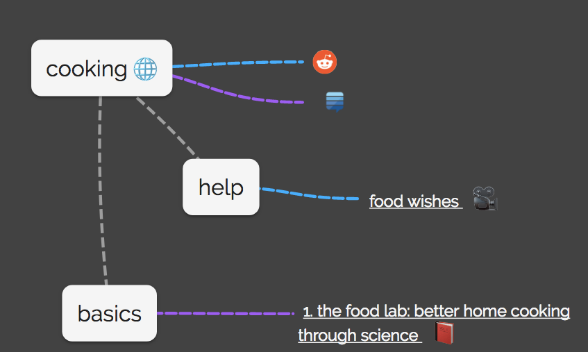
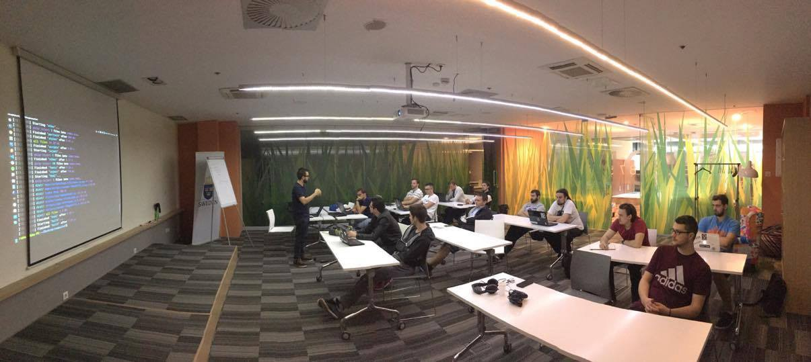

A team of developers just launched an open source search engine that will show you how to learn pretty much anything. It works by clustering resources into “mind maps.”

Here’s part of their mind map for [web development](https://fcc.im/2s3KiaD):

They have mind maps with resources for learning a wide range of subjects and skills, such as [philosophy](https://learn-anything.xyz/philosophy):

Some of their mind maps are more fleshed-out than others, but all of them are under development by the open source community.

You can [check out their live app](https://fcc.im/2slGogs) or [star their open source project on GitHub](https://fcc.im/2s3Hxq2).

### Here are three other links worth your time:

1.  Mastering Chrome Developer Tools: next level front-end development techniques ([6 minute read](https://fcc.im/2s3WFnd))
2.  How to scrape websites with Python and BeautifulSoup ([8 minute read](https://fcc.im/2rbTSHc))
3.  Node.js child processes: everything you need to know ([13 minute read](https://fcc.im/2teuFNg))

### Thought of the day:

> “I think it’s a new feature. Don’t tell anyone it was an accident.” — Larry Wall

### Funny of the day:

Webcomic by [Saturday Morning Breakfast Cereal](https://fcc.im/2rbxSfQ).

### Study group of the day:

[freeCodeCamp Sarajevo](https://fcc.im/2rjLytg)

Happy coding!

– Quincy Larson, teacher at [freeCodeCamp](http://bit.ly/2j7Q1dN)

If you get value out of these emails, please consider [supporting our nonprofit](http://bit.ly/donate-to-fcc).
