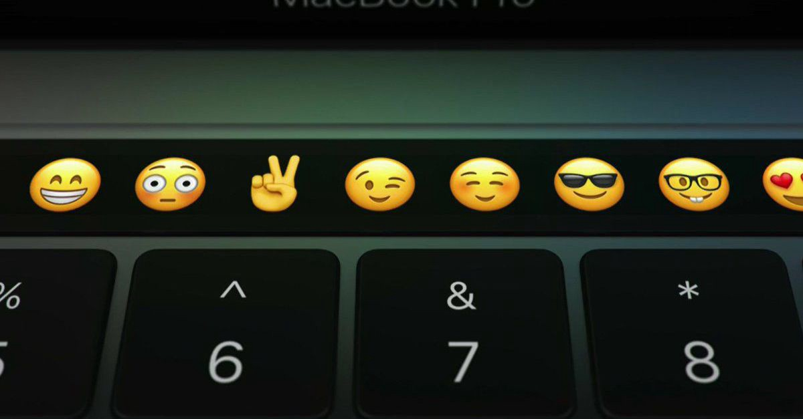

.](./asset-1.png)

For developers who were thinking about getting a new work laptop, here’s what Apple announced today:

-   They’re killing off the MacBook Air, one of the best-designed, most beloved laptops ever (which I’m using to type this)
-   Their new laptops have the same amount of RAM — and similar processors — to what they had years ago
-   They’re replacing the escape key and function keys — widely used by developers — with a little emoji bar

Of course, it will be used for a lot of other things, too:

At least they’re not removing the headphone jack yet.

But they did get rid of pretty much every other type of port.

How many Macs did Apple sell in the past 4 quarters? 19 million.

How many developers are there on earth? 19 million.

Funny coincidence, eh?

Apple is clearly resting on their laurels. They aren’t listening to at least one of their major customer segments: developers.

### Same specs, different day

MacBook Pros have offered up to 16 gigabytes of RAM since 2010. Guess where the 2016 MacBook Pro maxes out? 16 gigabytes. And that’s after a paid upgrade.

MacBook Pros offered dual-core 2.4 gigahertz processors in 201o. Guess what the stock 2016 MacBook Pro 13" comes with? Dual-core 2.0 gigahertz processors.

Thanks to [Eric Elliott](https://medium.com/@_ericelliott) for pointing out that you can upgrade the 15" version that up to a quad-core 2.9 gigahertz — but this version costs $3,000.

When you buy a brand new 2016 MacBook Pro, you’re paying $2,000 for what amounts to 2010 hardware with some marginal improvements on top of it. While there has [been some progress](https://browser.primatelabs.com/mac-benchmarks) over the past 6 years, the prices have remained significantly higher than what you would pay for comparable non-Apple hardware.

You can buy laptops with comparable specs (without nice-to-haves like the Retina display and the fancy Force Touch trackpad) for half the price. For example, here are a couple highly-rated laptops:

[**Lenovo ThinkPad Edge E460 14" HD Screen (1366x768), Intel Dual Core i5-6200U 2.2 GHz, 16GB RAM…**  
_Edit description_amzn.to](http://amzn.to/2fbMwC2 "http://amzn.to/2fbMwC2")

[**HP Pavilion 17 Gaming Laptop (Intel i7-6700HQ, 16GB DDR4 RAM, 128GB SSD + 1TB 7200rpm HDD, NVIDIA…**  
_Edit description_amzn.to](http://amzn.to/2eWy0ZT "http://amzn.to/2eWy0ZT")

Let’s face it — when a developer buys a Mac, what they’re really paying for is the software. The operating system. And the ecosystem of development tools built around that operating system.

Fortunately, there’s another Unix-like operating system that you can install on your computer: Linux.

Linux is nowhere near as user-friendly as MacOS. But with more resources from laptop manufacturers, it could get there, and quickly.

Even Linux arch-nemesis Microsoft has recently made strides to become more developer-friendly. Windows 10 now comes with [partial Linux support](http://www.howtogeek.com/265900/everything-you-can-do-with-windows-10s-new-bash-shell/).

### A second sunrise for desktop Linux?

MacBooks are becoming a less-appealing option for developers. But this is probably a big win for everyone in the long term.

With better competition from Windows, and more resources poured into Linux distributions, developers may soon have a wide range of great operating systems that can run on cheap “commodity” hardware.

If you’ve always been curious about Linux and want to learn more, check out my recent article about Linux at 25:

[**Linux is 25. Yay! Let’s celebrate with 25 stunning facts about Linux.**  
_25 years ago this week, a college student in Finland shared his project on an email list:_medium.freecodecamp.com](https://medium.freecodecamp.com/linux-is-25-yay-lets-celebrate-with-25-rad-facts-about-linux-c8d8ac30076d "https://medium.freecodecamp.com/linux-is-25-yay-lets-celebrate-with-25-rad-facts-about-linux-c8d8ac30076d")

Thanks for reading and happy coding!

**I only write about programming and technology. If you** [**follow me on Twitter**](https://twitter.com/ossia) **I won’t waste your time. 👍**
