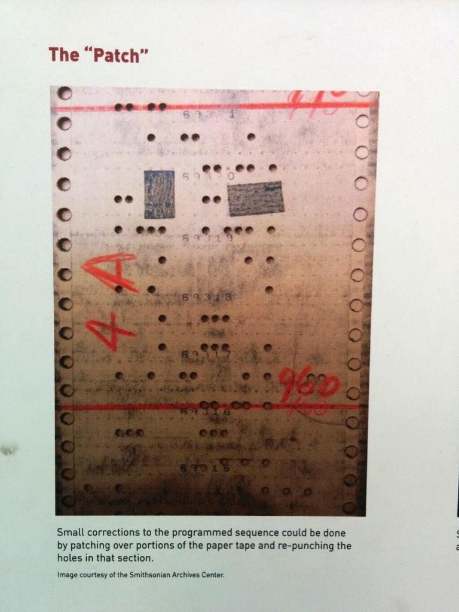

Here are three links worth your time:

1.  Browser security and the line of death ([5 minute read](http://bit.ly/2iZ7rG0))
2.  Use the Zeigarnik Effect to learn to code faster ([4 minute read](http://bit.ly/2jgUoAE))
3.  A security researcher discovered a way to steal passwords through McDonalds’ wifi sign-in screen ([3 minute read](http://bit.ly/2iE4YD0))

Bonus: The architecture of freeCodeCamp — an interview with Berkeley Martinez ([68 minute listen](http://bit.ly/2jgVP28))

### Thought of the day:

> “Amateurs hack systems, professionals hack people.” — Bruce Schneier

### Image of the day:

Here’s where the term “patching” a program came from:

Happy coding!

– Quincy Larson, teacher at [freeCodeCamp](http://bit.ly/2j7Q1dN)
