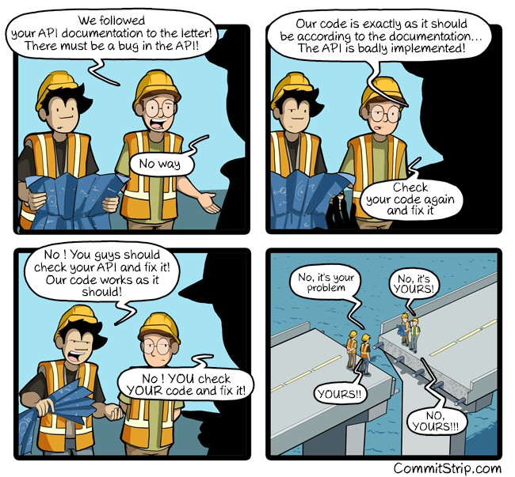
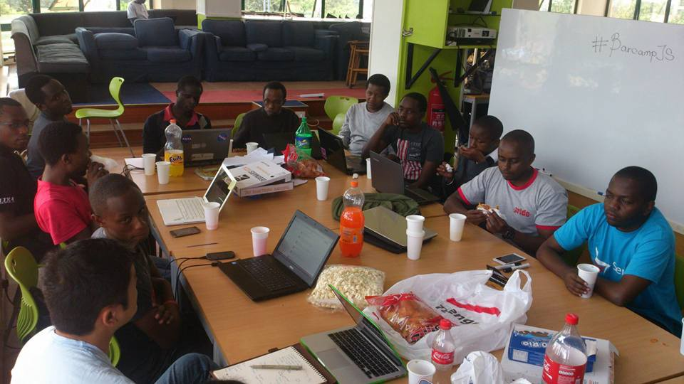

Here are three links worth your time:

1.  Cloudflare has been leaking HTTPS data from thousands of major websites for months. freeCodeCamp uses CloudFlare, but not the products that were vulnerable, so your data with us (which is really just your email address and BCrypt-encrypted password) was NOT affected. Here’s a postmortem of the bug by a Cloudflare engineer ([13 minute read](http://bit.ly/2li1gy5))
2.  Inside Facebook’s AI machine ([20 minute read](http://bit.ly/2lE0yfz))
3.  After 9,223,372,036,854,775,808 tries, Google has created the first SHA-1 collision, proving that the encryption scheme is no longer secure ([4 minute read](http://bit.ly/2lSjKc5))

Bonus: How an AI is learning how to beat the best human players at Super Smash Bros. Melee ([10 minute read](http://bit.ly/2mltKaV))

### Thought of the day:

> “The mantra of any good security engineer is: “Security is a not a product, but a process.” It’s more than designing strong cryptography into a system; it’s designing the entire system such that all security measures, including cryptography, work together.” — Bruce Schneier

### Funny of the day:

Webcomic by [CommitStrip](http://bit.ly/2lBZ3Qv)

### Study group of the day:

[freeCodeCamp Nairobi](http://bit.ly/2mfV2mr)

Happy coding!

– Quincy Larson, teacher at [freeCodeCamp](http://bit.ly/2j7Q1dN)
