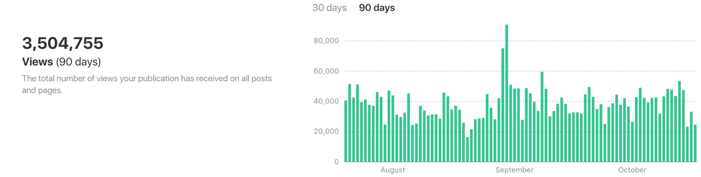

Here are three stories we published this week that are worth your time:

1.  One year in, our community’s Medium publication is already getting a million views a month: [4 minute read](http://bit.ly/2eChcMy)
2.  Three ways you can find the largest number in an array using JavaScript: [4 minute read](http://bit.ly/2dldRAI)
3.  How to launch an effective landing page for your project: [8 minute read](http://bit.ly/2eeTgwb)

Bonus: Our community just designed new laptop stickers. [Get all 4 with free worldwide shipping](http://bit.ly/2cGNEx2).

Happy coding,

Quincy Larson, teacher at Free Code Camp
