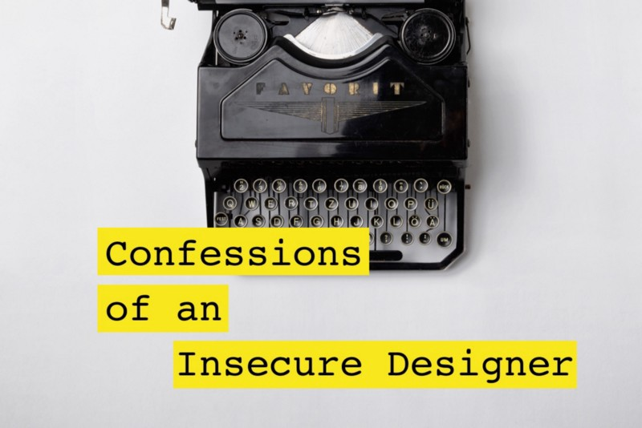

Here are three stories we published this week that are worth your time:

1.  Confessions of an Insecure Designer: [3 minute read](http://bit.ly/2byQ1xN)
2.  Aline’s analysis of how developers rated their own performance during interviews, versus how interviewers rated them: [5 minute read](http://bit.ly/2bIaLqa)
3.  If Correlation Doesn’t Imply Causation, Then What Does? [9 minute read](http://bit.ly/2bnz63Z)

Bonus: Celebrate the Open Data movement with this awesome T-shirt. We just launched it today (in fitted women’s sizes, too) [in our shop](http://bit.ly/2b099sb).

Happy coding,

Quincy Larson, teacher at [Free Code Camp](https://www.freecodecamp.com)
