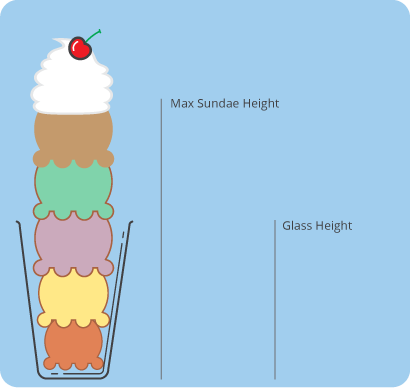

Here are three stories we published this week that are worth your time:

1.  CSS positioning explained by building an ice cream sundae: [5 minute read](http://bit.ly/2cp9G6X)
2.  So a product manager asks you to fix a bug… [7 minute read](http://bit.ly/2bY62PC)
3.  Move fast and don’t break things: [5 minute read](http://bit.ly/2bTENVn)

Bonus: Ward Cunningham, inventor of the wiki, famously said, “It’s all talk until the code runs.” Spread his wisdom with this jet black t-shirt, available in mens and fitted women’s sizes [in our shop](http://bit.ly/2b099sb).

Happy coding,

Quincy Larson, teacher at Free Code Camp
