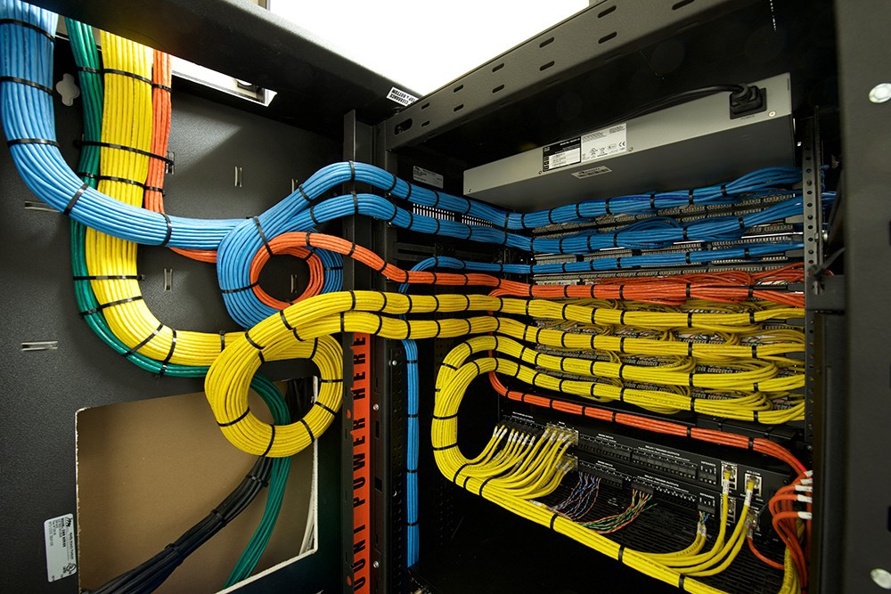

Here are three stories we published this week that are worth your time:

1.  This week, do an Hour of Code with your kids: [3 minute read](http://bit.ly/2h76kXk)
2.  The hardest part of learning to code is also the funnest part: [8 minute read](http://bit.ly/2gPkIQS)
3.  How a single indexing mistake nearly cost us a boat-load of money: [5 minute read](http://bit.ly/2gC5QYn)

Bonus: Our community designed a cryptography-inspired ugly Christmas sweater. 🎄 It’s only available for a few more days. You can [read about its origins](http://bit.ly/2fVxpwD) and [get one in our shop](http://bit.ly/2cGNEx2).

Happy coding,

Quincy Larson, teacher at Free Code Camp
