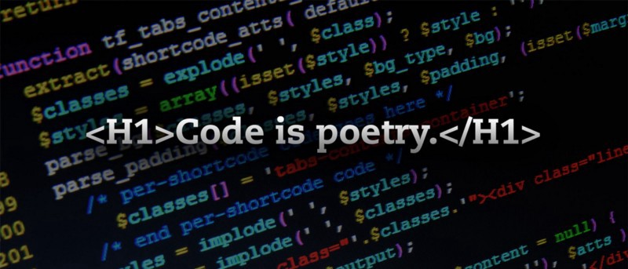

Here are three articles we published this week that are worth your time:

1.  Good code is its own best documentation: [3 minute read](http://bit.ly/2avxmF6)
2.  So, you want to work in security? [8 minute read](http://bit.ly/2aWYCsI)
3.  Here are all the Git commands I used last week, and what they do: [7 minute read](http://bit.ly/2aHr46O)

Bonus: I just finished Elon Musk’s biography and it’s definitely worth reading. You can get the audiobook for free with a free trial of Audible, then learn while you commute: [13 hour listen](http://amzn.to/2aAvfvM)

Happy coding,

Quincy Larson, teacher at [Free Code Camp](https://www.freecodecamp.com)
