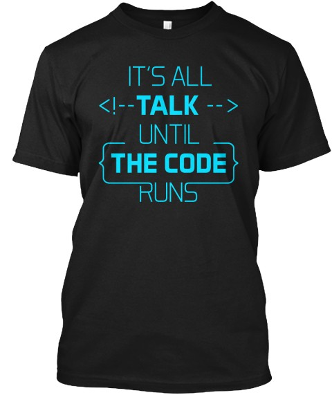

Here are three stories we published this week that are worth your time:

1.  How not to bomb your offer negotiation: [27 minute read](http://bit.ly/2czV9Fy)
2.  I hosted free design workshops. Then we built a dog adoption app as a team: [6 minute read](http://bit.ly/2ccojZz)
3.  You will randomly bomb technical interviews. Almost everyone does. Here’s the data: [10 minute read](http://bit.ly/2bMxccW)

Bonus: Ward Cunningham, inventor of the wiki, famously said, “It’s all talk until the code runs.” Spread his wisdom with this jet black t-shirt, available in mens and fitted women’s sizes [in our shop](http://bit.ly/2b099sb).

Happy coding,

Quincy Larson, teacher at Free Code Camp
