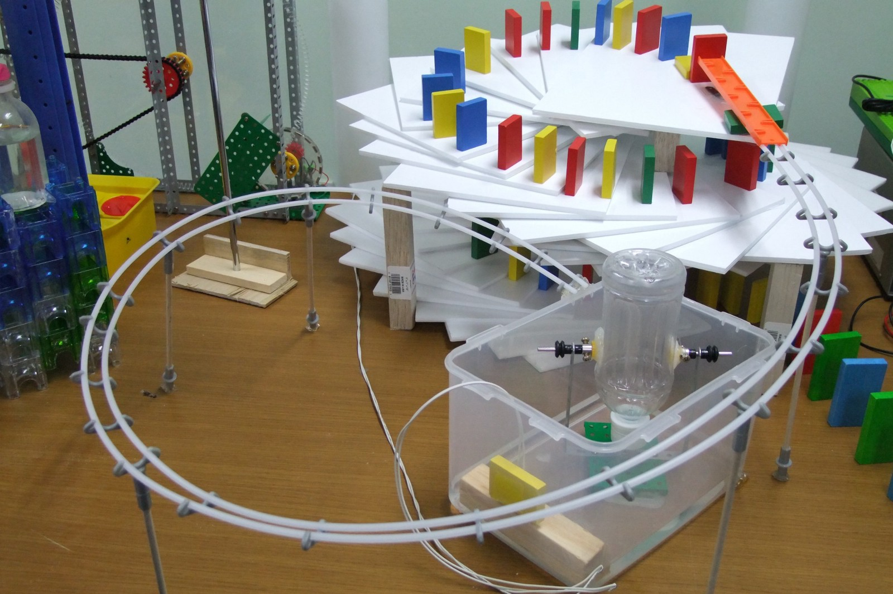

Here are three stories we published this week that are worth your time:

1.  A Gentle Introduction to Data Structures: How Linked Lists Work: [10 minute read](http://bit.ly/2eXvlis)
2.  Your best work will be invisible: [4 minute read](http://bit.ly/2f1GBxt)
3.  How HATEOAS and the Richardson Maturity Model work: [8 minute read](http://bit.ly/2fdTlP0)

Bonus: It’s getting cold out there! So pick up a toasty Free Code Camp hoodie today [in our shop](http://bit.ly/2b099sb).

Happy coding,

Quincy Larson, teacher at Free Code Camp
