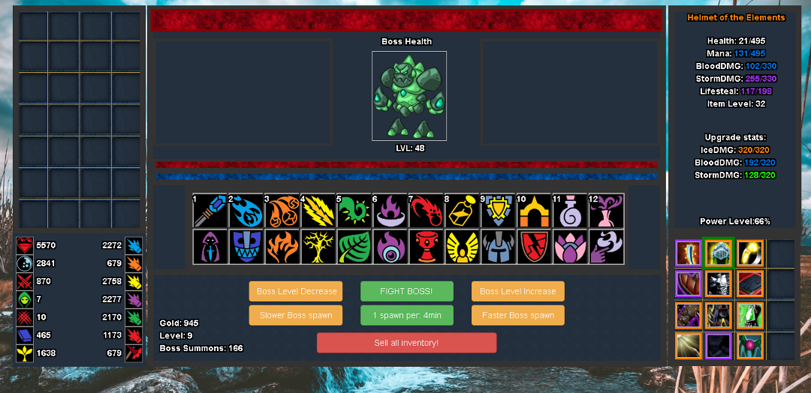

Here are three stories we published this week that are worth your time:

1.  I built a role playing game in JavaScript. You can, too. Here’s how: [7 minute read](http://bit.ly/2cTGuBi)
2.  Identity crisis: am I a developer or a designer? [5 minute read](http://bit.ly/2cH00BC)
3.  Don’t ruin your : [7 minute read](http://bit.ly/2cACxDZ)

Bonus: You can get new Free Code Camp gear today [in our shop](http://bit.ly/2b099sb).

Happy coding,

Quincy Larson, teacher at Free Code Camp
