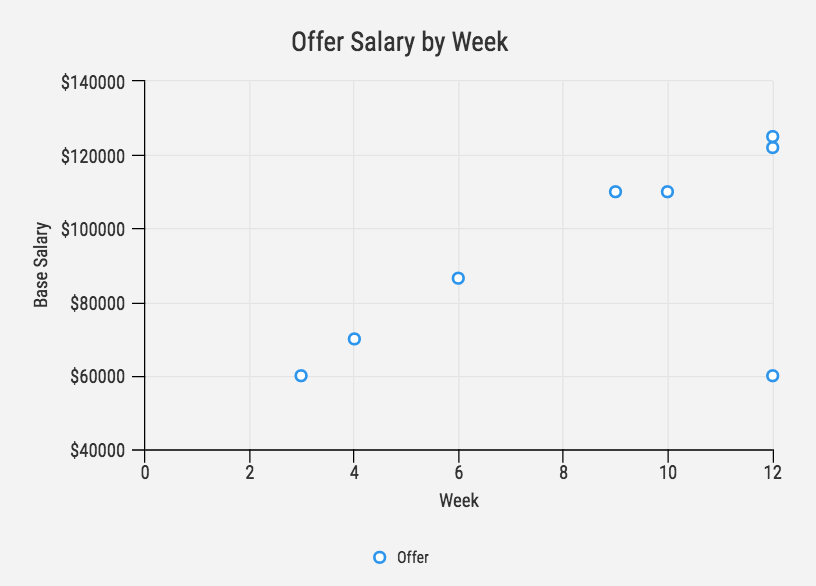

Here are three stories we published this week that are worth your time:

1.  I spent 3 months applying to jobs after a coding bootcamp. Here’s what I learned: [5 minute read](https://medium.freecodecamp.com/5-key-learnings-from-the-post-bootcamp-job-search-9a07468d2331#.be8tsqeal)
2.  CSS Selectors Explained By Going Car Shopping: [5 minute read](https://medium.freecodecamp.com/css-selectors-explained-by-going-car-shopping-51a383f6eb4b#.8wcw3a6hy)
3.  How to attract new contributors to your open source project: [5 minute read](https://medium.freecodecamp.com/how-to-attract-new-contributors-to-your-open-source-project-46f8b791d787#.nirj822zb)

Bonus: Our community designed laptop stickers. [Get all 4 with free worldwide shipping](https://www.freecodecamp.com/shop).

Happy coding,

Quincy Larson, teacher at Free Code Camp
