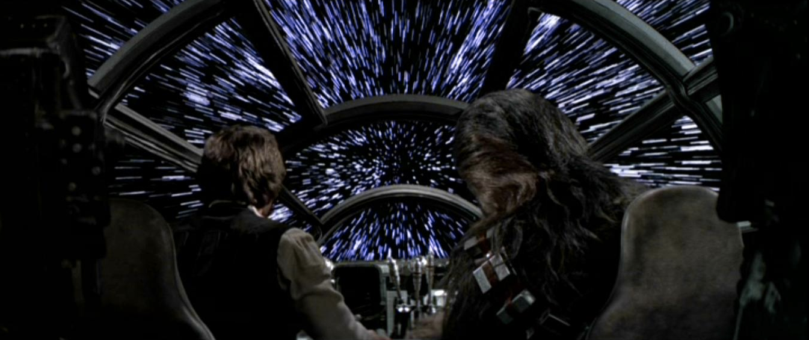

Here are three stories we published this week that are worth your time:

1.  It’s faster here: [3 minute read](http://bit.ly/2iAOCZe)
2.  How to crank your progressive web app’s Google Lighthouse score up to 100: [8 minute read](http://bit.ly/2iAGY0X)
3.  Ten principles I want to live by: [5 minute read](http://bit.ly/2idZO19)

Bonus: If you didn’t have plans for New Year’s Eve, well now you do. Ring in the new year with me, Briana Swift, and some very special guests during our community’s [#Open2017 live stream](http://bit.ly/2h6l1pk).

Happy coding,

Quincy Larson, teacher at Free Code Camp
