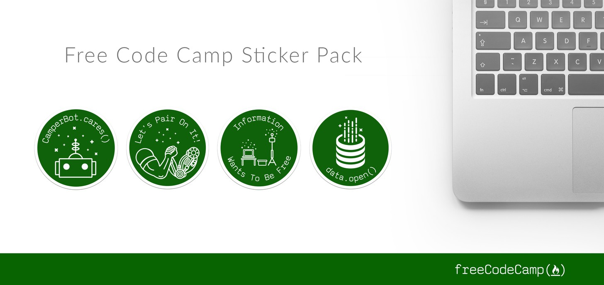

Here are three stories we published this week that are worth your time:

1.  It’s time to get in over your head: [6 minute read](http://bit.ly/2eavwti)
2.  What I learned from writing six functions that all did the same thing: [5 minute read](http://bit.ly/2e0vK34)
3.  I feel like Sherlock, if he were a developer: [2 minute read](http://bit.ly/2dSo7Ak)

Bonus: Our community just designed new laptop stickers. [Get all 4 with free worldwide shipping](http://bit.ly/2cGNEx2).

Happy coding,

Quincy Larson, teacher at Free Code Camp
