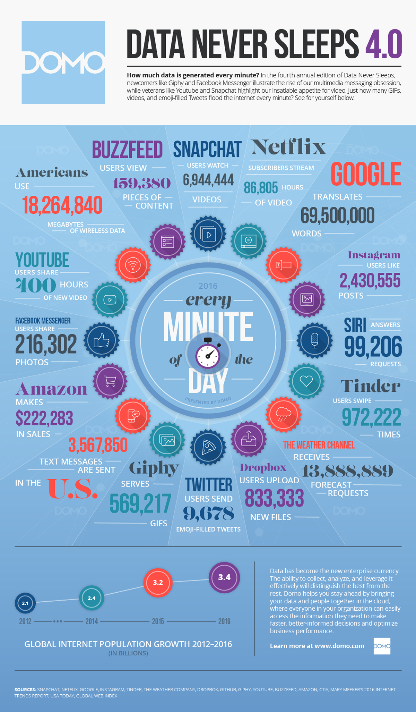

Here are three stories we published this week that are worth your time:

1.  What you do after you graduate matters way more than where you went to school. Here’s the data: [7 minute read](http://bit.ly/2iEuoBA)
2.  How Free Code Camp keeps me grounded as a recent bootcamp grad: [7 minute read](http://bit.ly/2iEHT3Y)
3.  The 10 best free online courses of 2016 according to the data: [5 minute read](http://bit.ly/2iEB16I)

Bonus: So far more than 1,000 people have committed to the #100DaysOfCode challenge. If you want to rapidly improve your coding skills, you can [take this challenge too](http://bit.ly/2hvgvUA).

Finally, here’s a cool infographic to recap 2016:

Happy coding,

Quincy Larson, teacher at Free Code Camp
