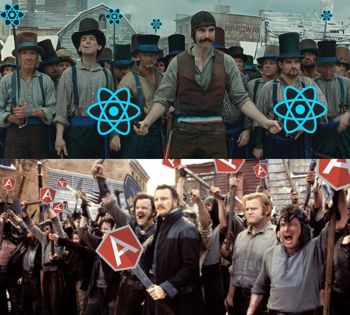
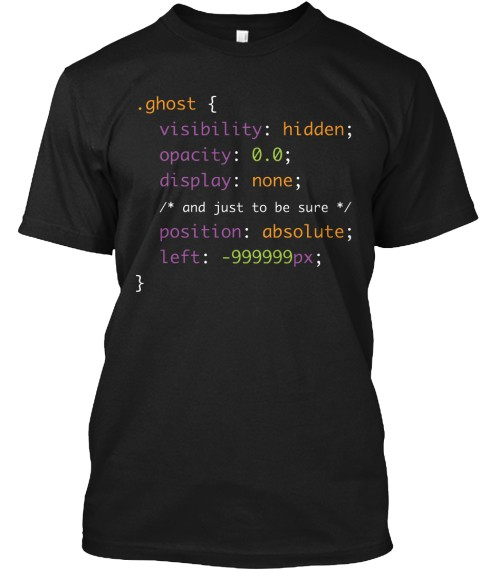

Over the past 12 months, I’ve edited nearly 500 stories written by hundreds of developers. Here are my personal favorites, which are definitely worth your time:

1.  Angular 2 versus React: There Will Be Blood: [10 minute read](http://bit.ly/2ejsqkj)
2.  Finding Time to Become a Better Developer: [8 minute read](http://bit.ly/2e9PCmj)
3.  Being a Developer After 40: [19 minute read](http://bit.ly/2dtnbAB)

Bonus: Our community designed this low-effort Halloween costume. [Pick one up](https://www.freecodecamp.com/shop) before Tuesday — in mens and fitted women’s sizes.

Happy coding,

Quincy Larson, teacher at Free Code Camp
