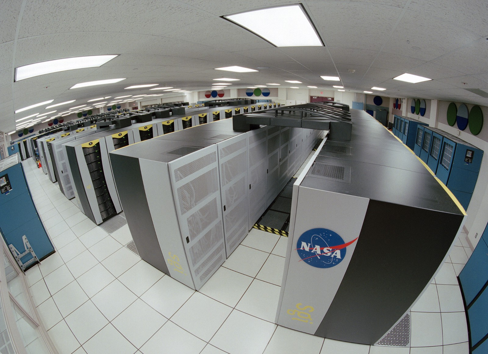

Here are three stories we published this week that are worth your time:

1.  With open data, you finally get what you’ve paid for all these years: [4 minute read](http://bit.ly/2bR3bby)
2.  It takes a village to raise a coder: [5 minute read](http://bit.ly/2bC6i5q)
3.  Constant Confusion: why I still use JavaScript function statements: [6 minute read](http://bit.ly/2bwq94d)

Bonus: If you want to learn more about data science but don’t know where to start, check out Nate Silver’s [The Signal and the Noise: Why So Many Predictions Fail — but Some Don’t](http://amzn.to/2bwrGY2)**.**

You can get the audiobook for free with a free trial of Audible, then learn while you commute: [15 hour listen](http://amzn.to/2bwrGY2)

Happy coding,

Quincy Larson, teacher at Free Code Camp
