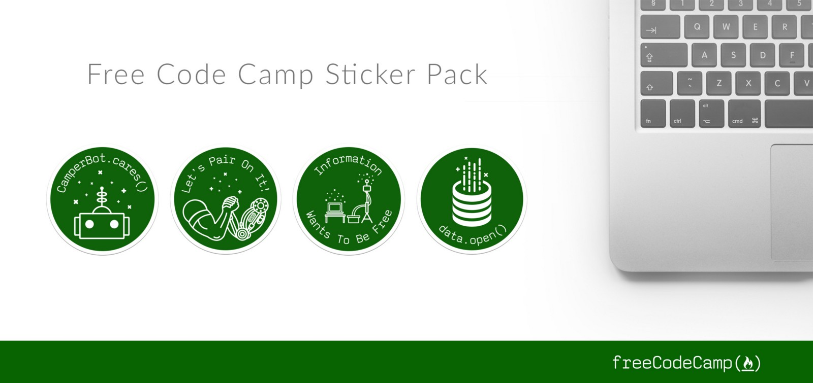

Here are three stories we published this week that are worth your time:

1.  A beginner’s guide to recursion: [6 minute read](http://bit.ly/2d5Nyga)
2.  Things you probably didn’t know you could do with Chrome’s built-in developer console: [6 minute read](http://bit.ly/2dyVgAA)
3.  My first experiences scaling a Meteor app: [17 minute read](http://bit.ly/2dvRB3B)

Bonus: Our community just designed new laptop stickers. [Get all 4 with free worldwide shipping](http://bit.ly/2cGNEx2).

Happy coding,

Quincy Larson, teacher at Free Code Camp
