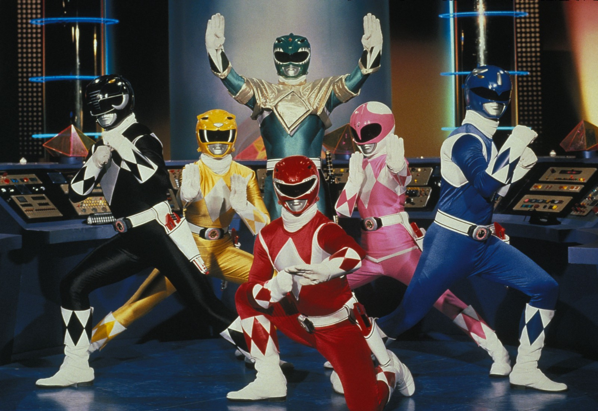

Here are three stories we published this week that are worth your time:

1.  The 6 most desirable coding jobs (and the types of people drawn to each): [6 minute read](http://bit.ly/2ckctJ9)
2.  CSS floats explained by riding an escalator: [6 minute read](http://bit.ly/2cF7xRS)
3.  The borderless, technology-focused mindset of Africa’s future leaders: [7 minute read](http://bit.ly/2d8EWI1)

Bonus: Did you know everything in [Free Code Camp’s shop](http://bit.ly/2cGNEx2) comes in fitted women’s sizes, too?

Happy coding,

Quincy Larson, teacher at Free Code Camp
