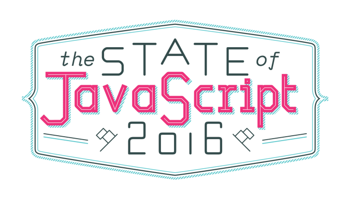

Here are three stories we published this week that are worth your time:

1.  The state of JavaScript in 2016: [5 minute read](http://bit.ly/2dJqVRy)
2.  Upgrading to macOS Sierra will break your SSH keys and lock you out of your own servers: [4 minute read](http://bit.ly/2dasi5v)
3.  How crowd curation improved our search quality by 27%: [5 minute read](http://bit.ly/2e4GwG0)

Bonus: Our community designed new laptop stickers. [Get all 4 with free worldwide shipping](http://bit.ly/2cGNEx2).

Happy coding,

Quincy Larson, teacher at Free Code Camp
