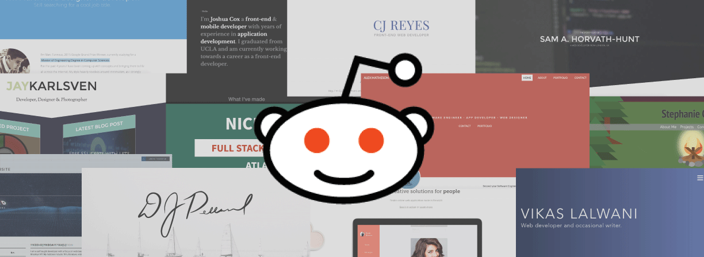

Here are three stories we published this week that are worth your time:

1.  What I learned from reviewing 50 portfolios on Reddit in 3 crazy days: [7 minute read](http://bit.ly/2d09FpK)
2.  My first open source adventure: [10 minute read](http://bit.ly/2dFB5PO)
3.  #ILookLikeAnEngineer 1 year later: [6 minute read](http://bit.ly/2dW5ebv)

Bonus: Our community designed new laptop stickers. [Get all 4 with free worldwide shipping](http://bit.ly/2cGNEx2).

Happy coding,

Quincy Larson, teacher at Free Code Camp
