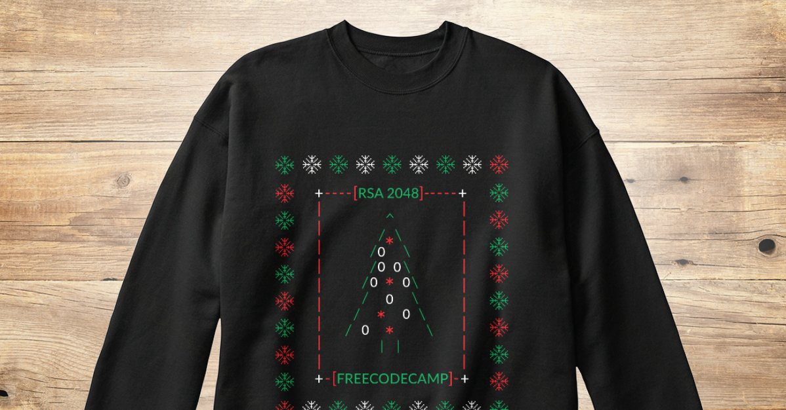

Here are three stories we published this week that are worth your time:

1.  You might not need that $15K coding bootcamp: [6 minute read](http://bit.ly/2hd3dJH)
2.  How a bunch of strangers in Fresno found a venue, threw coding events, and got developer jobs: [4 minute read](http://bit.ly/2gzwxu3)
3.  A Gentle Introduction to Data Structures: How Graphs Work: [8 minute read](http://bit.ly/2hefMIL)

🎄 Bonus: our community designed a cryptography-inspired ugly Christmas sweater. It’s **only only available for one more day**. You can [read more about it](http://bit.ly/2fVxpwD) and [get one in our shop](http://bit.ly/2cGNEx2).

Happy coding,

Quincy Larson, teacher at Free Code Camp
