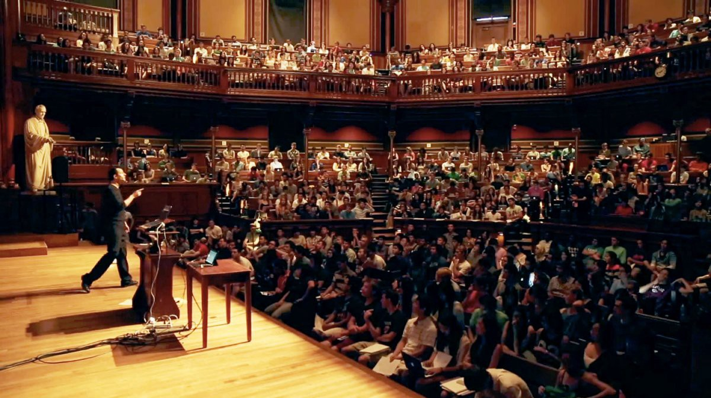
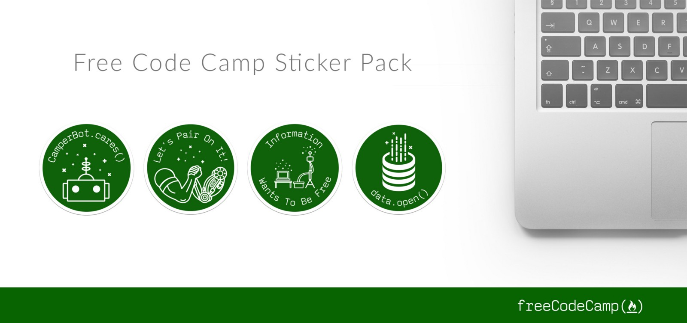

Here are three stories we published this week that are worth your time:

1.  Get a front-row seat in Harvard’s largest class, thanks to virtual reality: [2 minute read](http://bit.ly/2d8CU7j)
2.  How to find your first open source bug to fix: [5 minute read](http://bit.ly/2dqO32z)
3.  What Product teams can learn from the 1987 London Underground fire: [6 minute read](http://bit.ly/2d8BtG7)

Bonus: Our community just designed new laptop stickers. [Get all 4 with free worldwide shipping](http://bit.ly/2cGNEx2).

Happy coding,

Quincy Larson, teacher at Free Code Camp
