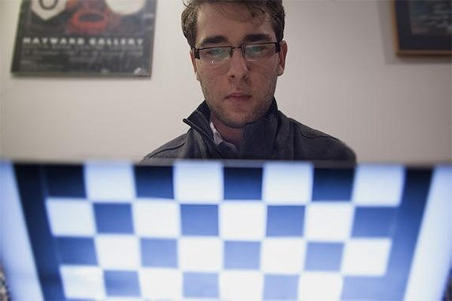
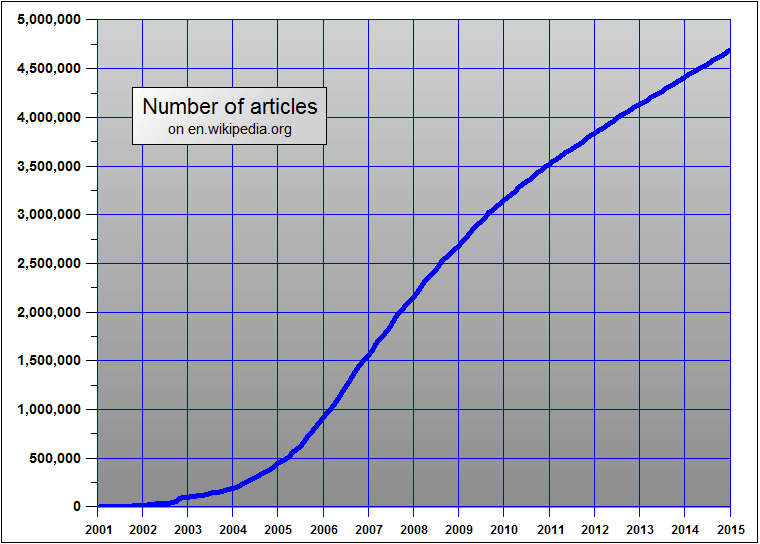
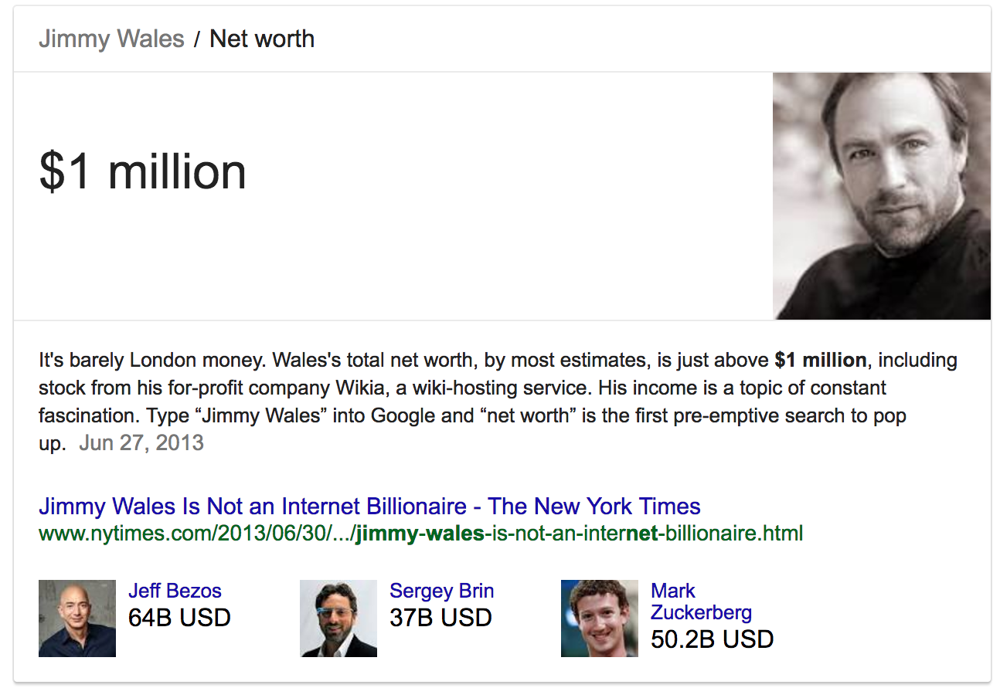

You’ve heard it before. Maybe you’ve even said it. “There’s no such thing as a free lunch.”

“You can’t get something for nothing.”

“Somebody has to pay.”

People recite these sayings with confidence, as though they were quoting Newton’s Laws of Motion.

But history has shown: you often _can_ get something for basically nothing.

And even when somebody has to pay, that somebody doesn’t have to be you, and the amount doesn’t have to be very much at all.

In some cases, the benefits so vastly outweigh the costs that it is — for all practical intents and purposes — a free lunch.

### How we eradicated Polio from the face of the Earth

In the early 1950s, the US was recovering from its worst Polio epidemic ever. Thousands of children died from this virus, and many more suffered life-long paralysis.

No one was safe from this horrible disease. Even US president Franklin D. Roosevelt contracted it at age 39. He spent the rest of his life in a wheelchair.

Enter Jonas Salk, a medical researcher who had mainly studied flu viruses before turning his efforts toward Polio.

Dr. Salk spent 7 years assembling a team of researchers and working to develop a Polio vaccine.

He conducted the most extensive field test ever, involving what historian Bill O’Neal says were “20,000 physicians and public health officers, 64,000 school personnel, and 220,000 volunteers.”

The vaccine was a success. So Dr. Salk set to work immunizing everyone on Earth. He pushed the marginal costs of the Polio vaccine as low as possible — to just the raw materials necessary — by forgoing any financial benefits his intellectual property would have brought him.

When asked about his patent, he said, “There is no patent. Could you patent the sun?”

Dr. Salk stared down a massive problem and threw himself into it with everything he could, without any aspiration for personal gain. And in the process, he and his colleagues basically wiped out one of the worst diseases ever.

Today, everyone’s life is better off as a direct result of this one massive free lunch.

> “The reward for work well done is the opportunity to do more.” —Dr. Jonas Salk

### Free lunches are important

Before I run through some modern-day examples of free lunches, let me give you some background on myself, and why the notion of a free lunch is so important to me.

I run a nonprofit, open source community where you can learn to code, practice by building software for nonprofits, then get a job as a developer. Thousands of people have gotten developer jobs so far. And it’s free.

I was so committed to the idea of it being free that I put the word “free” in the name.

Free can mean both **libre** — free as in free speech, and **gratis** — free as in free beer. Just like the “free” in “Free Open Source Software” (FOSS), the “free” in “freeCodeCamp” means both of these.

But still, every day I encounter people who are skeptical. They tell me they don’t use freeCodeCamp because “it sounds too good to be true.”

“There’s no way all this can be free,” they say. “I’ll sign up and give you my email address, and only then will I find out that I need to pay $20 a month, right?” Or: “You’re free for now, but soon you’ll throw up ads and paywalls, like everybody else does.”

Well, I’ve said this publicly a hundred times, and I’ll say it publicly again: **freeCodeCamp will always be free.**

We operate on the fringe of capitalism. The frontier where marginal costs asymptotically approach zero, and the very laws of classical economics begin to unravel. A place called the **abundance economy**.

And we’re not alone.

### Low overhead engineering with lichess.org

Meet Thibault Duplessis, the founder of [lichess.org](http://lichess.org/) — the second most popular chess website on the planet.

As of [a year ago](https://en.lichess.org/blog/VgwCfhwAAB8AbzkK/100000000-games-played), lichess had 78,000 unique daily visitors, who play a total of 260,000 games of chess each day.

Thibault has no employees. He doesn’t even work on lichess full-time. He still has a job at a development consultancy.

Lichess’s main competitor, [Chess.com](http://chess.com/), is a privately-held behemoth that makes millions of dollars each year off of banner ads and premium membership up-sells, then spends that money [acquiring their competition](https://gigaom.com/2009/12/22/419-chess-com-buys-rival-site-chesspark/).

Contrast this with Thibault, who has [open-sourced lichess’s server code](https://github.com/ornicar/lila). He has promised that lichess will be free forever, and that it will never show ads.

But wait — how can he do this?

Because of the nature of modern web applications, and the economics of their near-zero marginal costs.

Despite lichess’s complexity — and the scale at which it operates — Thibault’s server costs are a mere $416 a month.

This cost is covered by merchandise and donations from his grateful users, who increasingly include some of the best chess players in the world.

### How Craigslist covers costs by charging only 0.1% of its users

Remember classifieds?

People used to pay a dollar per word for tiny ads that appeared in the backs of newspapers, sandwiched between other ads.

Then, 20 years ago, Craigslist utterly disrupted classifieds. They provided a directory of ads online, for free.

It was searchable. You could use as many words as you wanted, and include pictures. You could repost your ads as many times as you wanted, in as many nearby cities as you wanted.

But if placing ads on Craigslist was free, how did Craigslist make money?

Well, if you asked a random Craigslist user, they probably wouldn’t be able to tell you. Most people just assume that Craigslist is a nonprofit, supported by donations or something.

But Craigslist made $400 million last year.

They did it by charging to post in a few key categories within a few key cities. If you want to list an apartment in New York City, or a job in San Francisco, you have to pay Craigslist a small fee.

This means that less than one in a thousand people who use Craigslist actually pay any money to do so. Those real estate agents in New York City and those recruiters in San Francisco are paying for everyone else’s free lunch.

, who founded Craigslist, in front of its old headquarters.](./asset-5.jpeg)

Craigslist doesn’t have investors. It keeps things simple. It has a small team of about 40 people.

Craig still works at Craigslist. He handed over the role of CEO to his long-time friend so he could focus on doing what he loves: providing support for Craigslist users around the world.

Like the other people mentioned in this article, he doesn’t seem to care about money. From what I can tell, he donates most of his money through his charity [CraigConnects](https://craigconnects.org/). And he spends his downtime advocating for causes he cares about, like supporting veterans and helping more women start their careers in tech.

### Crowd-sourcing contributions with Wikipedia

Before Wikipedia, the most popular encyclopedia was written by paid experts, and printed in massive books. The Encyclopaedia Britannica was so expensive that they wouldn’t even tell you its price in their TV spots. (It cost $1,400.)

<Embed src="https://www.youtube.com/embed/aosNMvldmAk?feature=oembed" aspectRatio={undefined} caption="" />

Jimmy Wales — Wikipedia’s visionary leader — had a better idea. He leveraged the power of the internet and the wisdom of volunteer contributors. And he made it free.

The number of volunteer-contributed articles on Wikipedia exploded. It quickly surpassed traditional encyclopedias in the scope of its content.

Instead of waiting for a new physical edition to hit the press, Wikipedia editors could instantly publish updates to articles. Wikipedia was so up-to-date that many people started using it for news on current events.

Traditional encyclopedias were quickly backed into a corner. They were paying expert writers and editors to create their content. Surely this resulted in more accurate information than Wikipedia’s volunteer-driven free-for-all.

But in 2005, a major academic journal published an analysis comparing the factual accuracy of Wikipedia versus the Encyclopaedia Britannica. It found:

> “Jimmy Wales’ Wikipedia comes close to Britannica in terms of the accuracy of its science entries, a _Nature_ investigation finds.” — The [abstract](http://www.nature.com/nature/journal/v438/n7070/full/438900a.html) from Nature’s analysis

In a last-ditch effort, The Encyclopaedia Britannica pushed back, but Nature upheld its finding.

This was the final blow to the encyclopedia industry, which had flourished for decades by selling stacks of books [door-to-door to guilty parents](http://www.slate.com/articles/technology/technology/2012/03/the_encyclopedia_britannica_was_expensive_useless_and_exploitative_i_m_glad_it_s_gone_.html).

A decade later, Wikipedia is now the 6th most visited website on the planet. And covers its operating costs through more than $70 million in donations each year from grateful patrons.

But despite all of Jimmy’s accomplishments, people seem to be much more preoccupied with his money. Or rather, his lack-there-of.

Here’s what you get when you type “Jimmy Wales net worth” into Google:

Below this result, Google shows you pictures of people who started other large websites. Each of them has a net worth that’s **five orders of magnitude larger** than Jimmy’s paltry $1 million.

People have a hard time accepting that someone would set out to build something as important as Wikipedia without bothering to make money out of it.

One person went so far as to ask straight up on [Quora](https://www.quora.com/Is-Jimmy-Wales-rich/answer/Jimmy-Wales): “Is Jimmy Wales rich?”

Jimmy responded:

> “By any sane standard of measurement, yes, of course I’m rich. Nearly half of the people on earth live on less than $2 a day. I spend more than that on my cellphone bill.”

### There’s so much more to life than money.

Why are people so preoccupied by money, and the net worth of famous people? Because they’re operating in a **scarcity mindset**.

They are so preoccupied by the risk of not having enough that they can’t see the real risk: missing out on the potential for so much more.

The traditional scarcity mindset approach to creating value at scale goes something like this:

1.  Figure out a problem you can solve for a large number of people

2a. If people will pay for your product, sell it to them, then re-invest the profits into growing your business (bootstrapping)

2b. If your solution isn’t something people will pay for, raise a bunch of venture capital to fund development. Once it’s big enough, make money some other way — usually by selling ads.

But there’s an alternative. An **abundance mindset**.

This approach shrugs off concerns for basic needs (worst case scenario, I have to get a job in fast food) and instead focuses on upside potential.

When you apply an abundance mindset, you approach problems from a different perspective. You try to identify opportunities for free lunches.

Your approach to creating value at scale will look something more like this:

1.  Figure out a problem you can solve for a large number of people
2.  Keep costs low, fund development yourself, and ask for donations, sell merchandise, or find a few users with deep pockets who can subsidize everyone else.

This is how all of these organizations I’ve discussed here operate. And this is how they can always be free.

If you want to learn more about the abundance economy, read [this excellent book](http://amzn.to/2fxCSYN) by the creator of the X-Prize and Singularity University:

[**Abundance: The Future Is Better Than You Think**  
_Edit description_amzn.to](http://amzn.to/2fxCSYN "http://amzn.to/2fxCSYN")

**I only write about programming and technology. If you** [**follow me on Twitter**](https://twitter.com/ossia) **I won’t waste your time. 👍**
