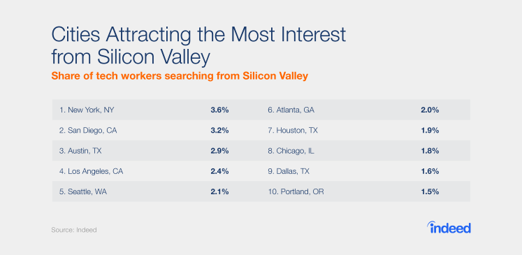
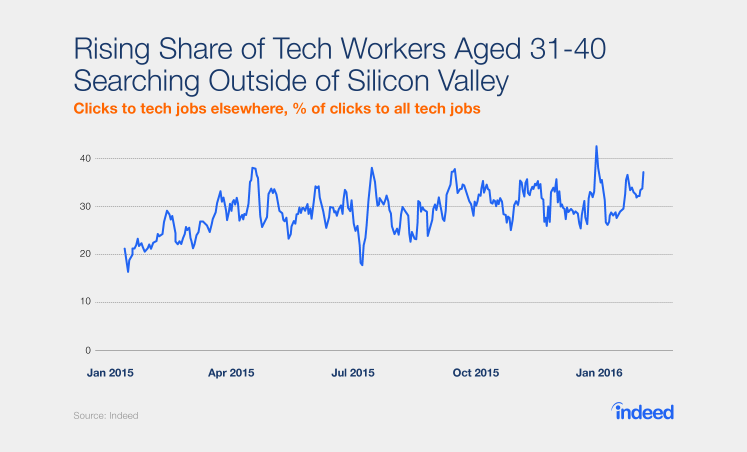
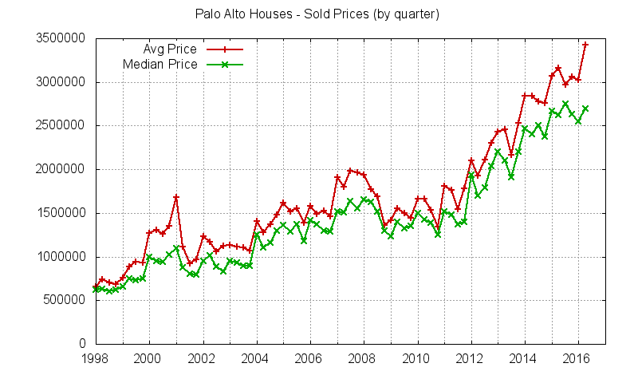
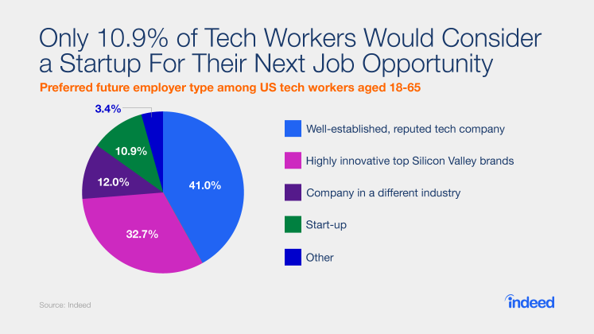
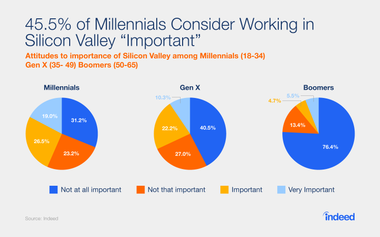
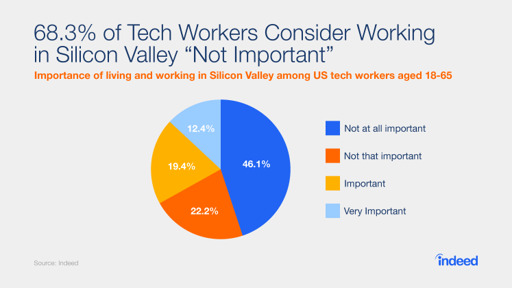

2 in 3 developers consider working in Silicon Valley is not important. 

Sergey Brin on Silicon Valley:

“I think the world today one of the challenges of globalization is in relatively category there are relatively few victor. Being the number 5 or number 6 category in some category is not really viable, and that doesn’t give people a lot of space to explore or develop. Silcon valley tends to invest more to push the bounds there. I do think it would be great for our economies to sustain a greater diversity of companies and to allow more companies to be successful, even as we globalize within sectors. I think that would be healthier.”

“Silicon valley is not the easiest place to start something. During the boom cycles, the expectations around the costs: the real estate, the salaires, the expectations employees have. These make it hard to create some sort of scrappy business that’s self sustaining. In other parts of the world you might have an easier time than that. I think Silicon Valley is good at scaling the opportunity by providing more capital and allowing more risk.”

“I think the initial start, certainly during the silicon valley boom cycle is probably easier outside. People end up starting something and migrating here often.”

  

And it’s not just developers. A few days ago, Google founder Sergey Brin [advised participants](https://youtu.be/-NKQDbd5bXI?t=51m22s) at the Global Entrepreneurial Summit against coming to Silicon Valley to start their startups:

> “Silicon Valley is not the easiest place to actually start something. During the boom cycles, the expectations around the costs: the real estate, the salaries, the expectations that employees have. These make it hard to create some sort of scrappy business that’s self sustaining. In other parts of the world, you might have an easier time with that.”

