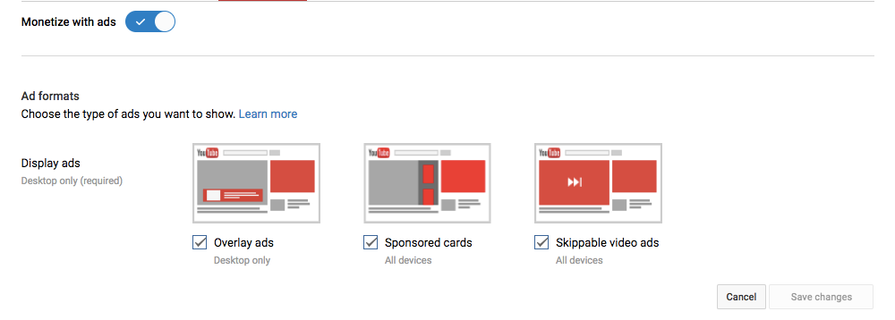
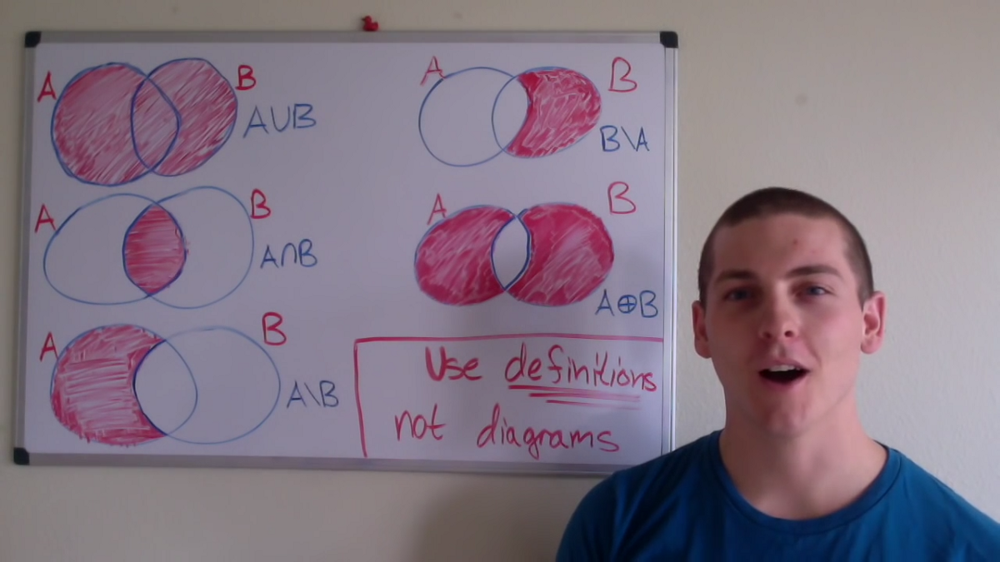
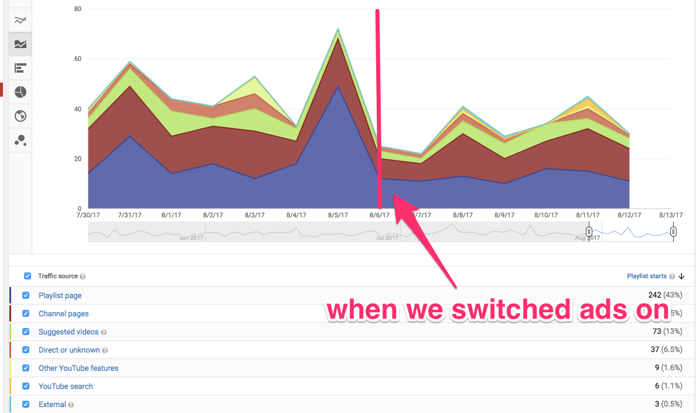
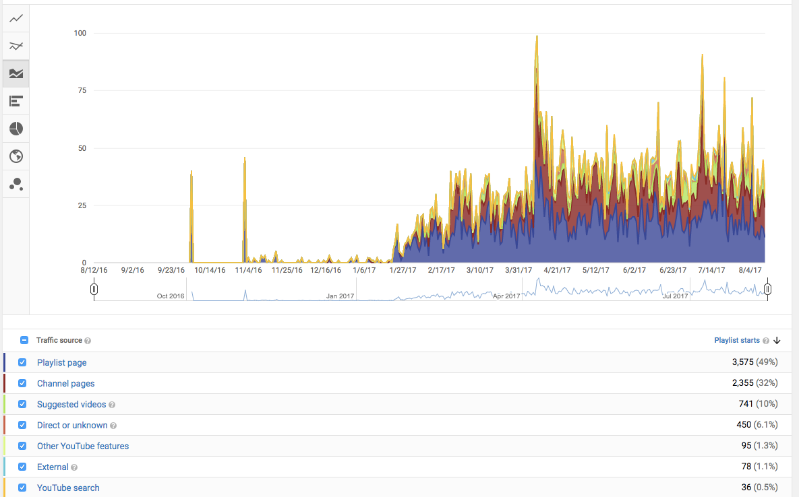

](./asset-1.png)

YouTube is the second largest search engine in the world. So for a small nonprofit like freeCodeCamp, it’s a great place to for people to discover our community.

The freeCodeCamp community publishes several new YouTube videos each week. And we want for these videos to reach as many people as possible.

At the same time, we’re a donor-supported nonprofit. We don’t show ads on freecodecamp.org or on our Medium publication, and we don’t want to show ads on YouTube either.

Well I woke up in the middle of the night in a cold sweat. I had been dreaming about freeCodeCamp’s YouTube channel, and a terrible thought had crept in: **Was YouTube penalizing our channel because we chose not to show ads?**

### YouTube’s business model relies on showing ads

YouTube relies on ad revenue as its core business model. So they have a clear economic incentive to prioritize videos that show ads in their search results. And in the videos they recommend in their sidebar. And the videos they videos they show on users’ home screens. And in notifications.

If you think about it, YouTube has incredible power over what people watch. You can encourage people to check out our YouTube videos through tweets and Facebook shares. But at the end of the day, almost all of your video views will be a direct result of YouTube’s recommendation engine.

This recommendation engine is entirely closed source. It’s a black box. And nobody outside of YouTube’s engineering team knows how it works. This uncertainty is one reason why companies pay YouTube billions each year to promote their videos and make sure they reach their intended audience.

So by not showing YouTube ads, was YouTube recommending freeCodeCamp’s videos less often than similar videos that had ads turned on?

I climbed out of bed, grabbed my laptop, and got to Googling. There were plenty of blog articles and forum posts where YouTubers would say things like: “obviously YouTube will recommend videos with ads more, because they make more money that way.” 

Conventional wisdom was you just swallowed your pride and turned on ads. Yes, these ads would annoy your viewers. But your videos would reach a larger audience. And you’d get paid, too.

But I couldn’t find any hard data. Everyone was saying “just show ads” but nobody had gone to the trouble of conducting an experiment.

Well I wasn’t going to subject freeCodeCamp’s subscribers to ads just based on a hunch. I needed hard data saying that this would significantly increase the reach of our community’s videos.

### Setting up the experiment

I decided to run ads on a single playlist for one week to see whether these ads increased YouTube’s likelihood of recommending these videos.

I wanted an older playlist that had a lot of videos. And I found it in Shawn Grooms’ Math for Programmers playlist.

Shawn recently earned a degree in Mathematics while also serving as a sergeant in the US Army. While learning to code with freeCodeCamp, he recorded a series of whiteboard explanations for mathematical concepts programmers. 

Shawn got his dream job as a software engineer, and plans to create more videos once he gets settled in. But for now, his playlist is pretty stable.

So 8 days ago, I turned on ads on all 34 of Shawn’s Math for Programmers videos to see what would happen.

### The results

  

Views on Shawn’s videos didn’t go up. They actually went down slightly.

The important insight is this: **turning on ads does not seem to significantly increase the amount of views your YouTube videos get.**

I draw this conclusion from a relatively small sample size (two weeks of view data, or about 2,000 views total). We can get away with this smaller sample size because we’re looking for a substantial difference in views.

I wouldn’t have consider turning on ads for our channel unless it was going to at least double the number of people who would discover our community’s videos. And ads clearly don’t increase the YouTube recommendation engine’s propensity to show your video by that much — if at all.

If you’re curious about the history of Shawn’s Math for Programmers playlist, 

As you can see, there are some spikes in Shawn’s playlist, but turning on ads wasn’t one of them.
