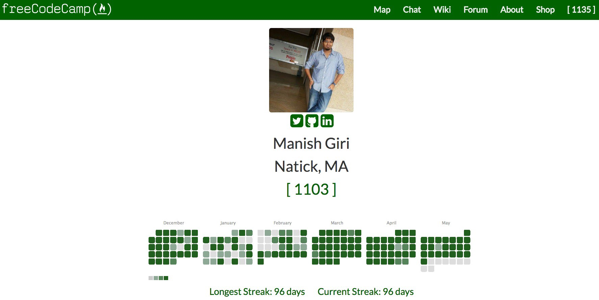

, creator of KeystoneJS](./asset-1.jpeg)

GitHub quietly removed their code streak feature on Thursday, as part of an update to their contribution graph.

Buried in an [announcement](https://github.com/blog/2173-more-contributions-on-your-profile) about how you can now get credit for private contributions (before, only open source contributions counted) they said:

> As part of this update, code streaks are no longer featured on your contribution graph. The simplified interface focuses on the work you’re doing rather than the duration of your activity.

Many developers were understandably happy that daily work on their employers’ closed-source projects would now be recognized on their contribution graph.

But a lot of developers were saddened by GitHub’s sudden, unilateral decision to remove code streaks.

Jed Watson, who had a 1,000+ day streak of open source contributions as of Thursday, wrote a [touching article](https://medium.com/@jedwatson/github-broke-my-1-000-day-streak-6ec0c4c3a7d9#.jbnq55ntg) about how his streak had followed him through many life milestones, such as the launch of [KeystoneJS](http://keystonejs.com/) and the birth of his daughter.

And Jed wasn’t alone. Many other famous open source contributors prided themselves on their consistent coding, as reflected in their long-running streaks.

Note that these charts — generated by the [Isometric Contributions Chrome extension](https://chrome.google.com/webstore/detail/isometric-contributions/mjoedlfflcchnleknnceiplgaeoegien) — only show the past year. Many open source contributors had unbroken streaks that stretched back several years.

, creator of Lodash](./asset-2.jpeg), creator of the Hackathon Starter](./asset-3.jpeg)

#### Why streaks matter

Someone once asked comedian Jerry Seinfeld how he managed to write so much original material. He pointed to a wall calendar covered in X’s and exclaimed, “Don’t break the chain!”

Here’s how it works: for every day that you sit down and write, you draw an X on your calendar. Soon you have a streak of X’s. And if you fail to write, you don’t draw an X. Your streak starts over.

By writing a little every single day, you ultimately get a lot more work done, because it becomes easier to get started, and you get [into the zone](https://en.wikipedia.org/wiki/Flow_%28psychology%29#Professions_and_work) faster.

The rational is that if you take a day off, it will take you longer to get back into the swing of things. You may even fall prey to the [what-the-hell effect](http://www.theguardian.com/lifeandstyle/2014/may/24/this-column-change-life-what-the-hell-effect) and say, “What the hell — I already broke my streak yesterday. Let me take just one more day off…”

#### Write Code Every Day

John Resig, creator of jQuery, took the “Don’t Break the Chain” approach and applied it to coding. His [blog post](http://ejohn.org/blog/write-code-every-day/) launched the “Write Code Every Day” movement.

, creator of jQuery](./asset-5.jpeg)

I encountered Resig’s “Write Code Every Day” article back in October 2014, when I was building the first version of Free Code Camp. I decided to try coding every day like he recommended.

Sure enough, after a couple weeks of consecutive contributions, coding became second nature. I no longer needed to walk to a cafe or co-working space, then blast music through my headphones in order to pump myself up for programming.

Instead, I was able to roll out of bed, brew some tea, sit down at my kitchen table and get to work.

It’s hard to describe the forward momentum I felt. While I never an epic streak like the developers you see here, I did pull off 60+ consecutive days of open source contributions that year, and many shorter streaks since then.

So when it came time to decide which gamification elements we should include in Free Code Camp to encourage our campers, we naturally decided to try streaks.

You can get Brownie Points by completing coding challenges, and by helping fellow campers in our help chat rooms. And if you do so multiple days in a row, you’ll start a streak.

Streaks are an incredibly powerful way to keep learners motivated and steadily progressing toward their goals.

We’ll miss GitHub’s streaks. At the very least, they’ve inspired our open source community to use a similar mechanic to motivate people, and to keep people writing code every day.

Until next time, happy coding! Keep up that momentum, and don’t break the chain.

**I only write about programming and technology. If you** [**follow me on Twitter**](https://twitter.com/ossia) **I won’t waste your time. 👍**
