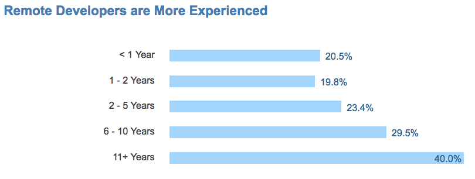
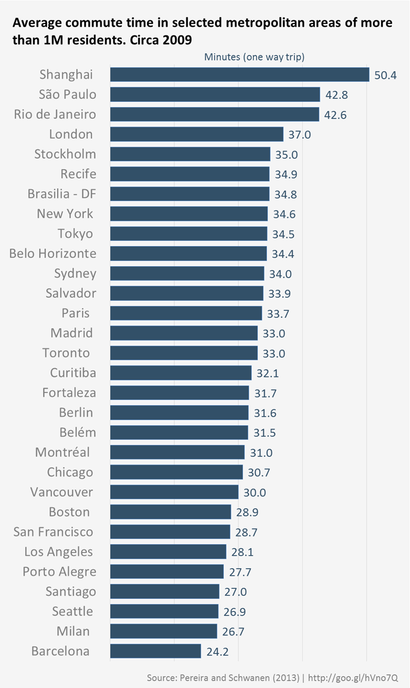

### An economic analysis of distributed teams

Travel the world as a digital nomad. Surf a new beach every morning. Eat a different local cuisine each night.

Or just stay home all day in your pajamas.

It doesn’t really matter. You can get your work done either way.

More than 10% of Americans now work remotely.

I’m one of them. After 10 years of working in an office, I’ve had the luxury of working out of my closet for the past 5 years. I could rave until I’m blue in the face about how great it is. But talk is cheap. Let’s look at data.

What are the economic costs and benefits of working remotely?

### Salary

We looked at more than 36,000 salaries of developers working both remotely and on-site from [Stack Overflow’s 2016 dataset](https://medium.freecodecamp.com/2-out-of-3-developers-are-self-taught-and-other-insights-from-stack-overflow-s-2016-survey-of-50-8cf0ee5d4c21#.f39zmdujb). Here’s what we found:

 and [Evaristo](https://github.com/evaristoc) in our [Data Science Room](https://gitter.im/FreeCodeCamp/DataScience) for analyzing these data and making these graphs.](./asset-2.png)

Of the 10,583 developers world-wide who reported working remotely some or all the time, their median salary was US $55,000, with a standard deviation of $51,200.

This was significantly higher than the salaries of the 25,413 non-remote developers. Their median salary was just $45,000, with a standard deviation of $44,727.

When you exclude developers outside of the United States, this wage difference remains. The 3,200 US-based remote developers had a median salary of $105,000 (with a standard deviation of $47,400), versus their 6,461 non-remote counterparts, whose median salary was only $95,000 (with a standard deviation of $ 42,977).

People who work remotely are most represented at the top and bottom ends of the pay scale.

Freelance developers who accept contracts through relatively low-paying channels like Upwork tend to be remote.

At the same time, developers with more than ten years of experience are twice as likely to work remotely as newcomers.

The caliber of developers who can command salaries of more than $200,000 have a lot of bargaining power. When they demand to work remotely, employers are more likely to yield.

Anecdotally, I’ve met plenty of high-paid developers who live up in the mountains, or who jet around the world, living out of hotels. You would have to pay them a small fortune to convince them to work out of an office, and even then they probably wouldn’t last long.

### Productivity

In 2012, Stanford researchers set out to better understand remote work and its implications. They conducted a [9-month study of 249 service sector workers](http://www.nber.org/papers/w18871.pdf) — the largest academic study of remote work ever.

Here are the key findings:

-   Remote workers were 13% more productive than on-site workers.
-   Remote workers worked longer shifts, took fewer breaks, and took fewer sick days.
-   Remote workers were half as likely as to quit as on-site workers, and reported significantly higher job satisfaction rates.

One downside the study found was that remote workers were 50% less likely to be promoted than their on-site counterparts. This may mean that it’s harder for bosses to form relationships with you if you work remotely.

### Lifestyle

Working remotely also offers some major cost-savings — both for employees and their employers.

In many cities, workers spend more than an hour per day commuting to and from their office.

Not having to commute saves you time. It also saves you the monetary cost of mass transit, or gas and depreciation on a car.

You also have to spend a lot of time getting ready for work. For many people, this means dressing up in a suit and/or putting on makeup — tasks you can skip if you’re working remotely.

My unscientific estimate (because no comprehensive study has yet been conducted) is that about a tenth of an on-site worker’s income — and a tenth of their time — would be immediately freed-up if they could work remotely.

Companies should also take note that during Stanford study, the employer saved $2,000 per employee in furniture and office space costs.

And don’t forget parking. In San Francisco, for example, [it costs an average of $38,000](http://sf.curbed.com/2016/6/8/11890176/it-costs-38000-to-create-one-parking-space-in-sf) to create a single new parking space for an employee.

### Is working remotely right for you?

The decision to work remotely is a highly personal one.

My goal here is to share the facts.

Instead of gushing about how great I personally think it is to work remotely, I recommend you read this excellent book:

[**The Year Without Pants: WordPress.com and the Future of Work**  
_Edit description_amzn.to](http://amzn.to/2bFzj06 "http://amzn.to/2bFzj06")

It’s by journalist Scott Berkun, who managed a remote team for a year at Automattic (the all-remote company behind WordPress).

[The Year Without Pants](http://amzn.to/2bFzj06) is filled with interesting first-hand anecdotes. It will give you a clear idea of what it’s like to work remotely.

Working remotely isn’t for everyone. But it is a viable option. And there are some compelling economic reason why it might make sense for you.

**I only write about programming and technology. If you** [**follow me on Twitter**](https://twitter.com/ossia) **I won’t waste your time. 👍**
