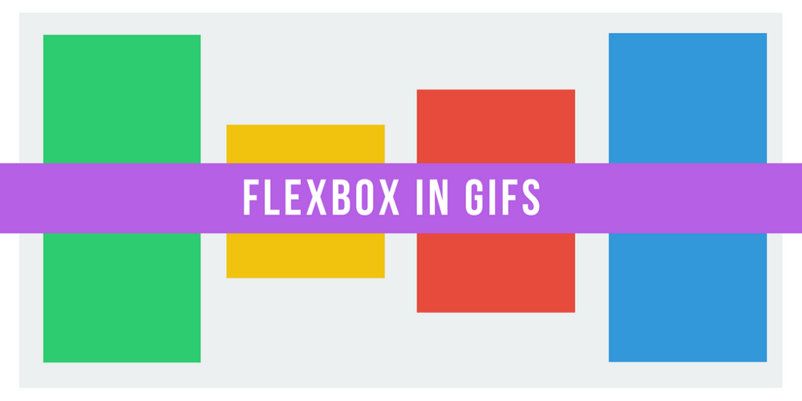

Here are three links worth your time:

1.  How Flexbox works — explained with big, colorful, animated gifs ([5 minute read](http://bit.ly/2jVr0PR))
2.  How to commit entire files and directories to GitHub using GitHub.js ([6 minute read](http://bit.ly/2kW94ot))
3.  GitLab — an open source alternative to GitHub — accidentally deleted their production data, and all five of their backup methods have failed ([3 minute read](http://bit.ly/2kVRUr0))

### Thought of the day:

> “Hardware: The parts of a computer system that can be kicked.” — Jeff Pesis

### Image of the day:

This programmer turned 24, but didn’t have enough candles. They had to improvise.

_hint: 11000._ [Image source](http://imgur.com/T4Rizkz)

Happy coding!

– Quincy Larson, teacher at [freeCodeCamp](http://bit.ly/2j7Q1dN)
