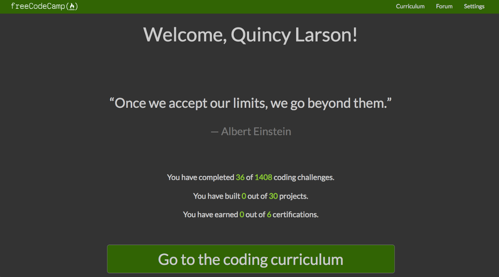

 curriculum with night mode turned on.](./asset-1.png)

For the past year, our community has been hard at work on a massive new programming curriculum. And now that curriculum is live and out of beta!

We’ve retooled freeCodeCamp’s curriculum to emphasize fundamental software development skills and concepts:

-   HTML, CSS, and JavaScript
-   Accessibility
-   Visual Design
-   Data Structures
-   Object-oriented Programming
-   Functional Programming
-   Debugging
-   Information Security
-   Testing

You’ll still learn specific tools like Node.js and React, but these appear further into our curriculum.

We recommend working through the curriculum in order from start to finish, but feel free to skip around if you just want to learn a specific skill.

### 6 new developer certifications you can earn.

**You can still claim all of the original 3 certifications** (Front End, Back End, and Data Visualization) from the freeCodeCamp settings page. And now we also offer 6 new certifications:

-   **Responsive Web Design** (HTML, CSS, Flexbox, CSS Grid)
-   **JavaScript Algorithms and Data Structures** (Just JavaScript. LOTS of JavaScript.)
-   **Front End Libraries** (React, Redux, Sass, Bootstrap, jQuery)
-   **Data Visualization** (D3.js)
-   **APIs and Microservices** (Node.js, Express.js, databases)
-   **Information Security and Quality Assurance** (Chai, Helmet.js, BCrypt, Passport.js)

Each of these new certifications has 5 required projects that you must complete. All the other coding challenges are optional, and serve to prepare you for these projects.

### Each of the 30 core curriculum projects has its own test suite.

In the past, freeCodeCamp’s projects just had user stories. It was up to you to interpret these user stories and turn them into working features.

Now every required project on freeCodeCamp has its own suite of tests. These tests can help guide your coding. And you can run them to see whether your project is ready to submit.

You can include these test suites in your project by including a single line of JavaScript. This means you can build your projects anywhere: on [CodePen](https://codepen.io), [Glitch](https://glitch.com), or right on your local computer. Our only requirement is that your projects have a publicly accessible URL on the web.

### Hundreds of new coding interview prep challenges

Thousands of people have asked for a section focused on coding interview preparation. So we’ve added hundreds of advanced algorithm and data structure challenges, and dozens of optional “take home projects” that you can build for practice.

Some of these challenges are extremely difficult, and will take even veteran programmers hours to complete.

Long after you’ve finished all of freeCodeCamp’s certifications, you can keep coming back and expanding your skills here.

### A lighting-fast learning platform

We’ve rebuilt our learning platform from the ground up. Our full curriculum is now on the [learn.freeCodeCamp.org](http://learn.freecodecamp.org/) subdomain. It’s a single-page React app with a clean, simple design.

We are caching the entire platform on [Netlify’s Content Delivery Network](https://www.netlify.com) so that it will be fast for you regardless of where you are in the world.

### Full stack web development challenges you can solve anywhere

Many of the challenges involve building Node.js applications. You can build these on your local computer, or on your own cloud server. 

We recommend using [Glitch](https://glitch.com), which is a free, convenient way to build your web apps without all the Git and Linux commands.

Then freeCodeCamp will hit your API end points and test your code for you to verify you’ve built the API correctly.

### A new as-you-type search box

Now you can search through more than 8,000 freeCodeCamp lessons, articles, videos, and podcasts, right from freeCodeCamp’s navigation bar.

### A new welcome dashboard

Each time you sign in to [www.freeCodeCamp.org](http://www.freecodecamp.org/), you’ll be greeted with a welcome dashboard. This will feature an inspiring quote and statistics about your progress through the freeCodeCamp curriculum.

### There will be bugs — help us fix them by reporting them

We just pushed a ton of new code. Even though we tested it to the best of our ability, there will always be things we missed. You can [track our open GitHub issues and create new issues here](https://github.com/freeCodeCamp/freeCodeCamp/issues).

I am excited to hear any feedback you may have on this new learning platform.

### Thank you!

A huge thank-you to the hundreds of open source contributors who helped design and test this new curriculum — many of whom will be at our [2018 Top Contributor parties](https://medium.freecodecamp.org/announcing-our-freecodecamp-2018-top-contributor-award-winners-861da08a77e1) in New York City, Dublin, and Hong Kong.

You can [jump into the new curriculum now](https://learn.freecodecamp.org).
