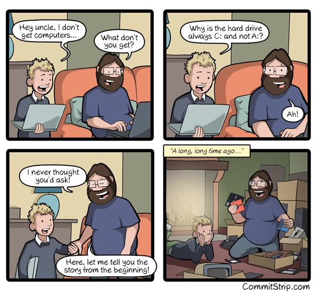
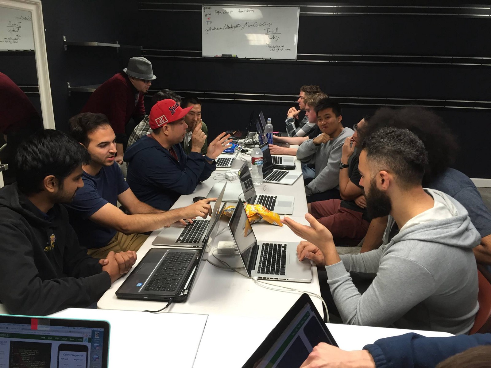

### Here are three links worth your time:

1.  How Sean went from working in a Knoxville rock climbing gym to working as a software engineer in a San Francisco cybersecurity startup, through 12 months of intense self-teaching ([8 minute read](https://fcc.im/2p32CxF))
2.  Here are 438 free online programming and computer science courses you can start in May ([browsable list](https://fcc.im/2oV2XHw))
3.  How to prevent your analytics data from being blocked by ad blockers ([6 minute read](https://fcc.im/2pQ3AlK))

Bonus: Starting today, all freeCodeCamp t-shirts and hoodies are now sold at-cost (with zero profit margin). We’re doing this so you get some cool threads and represent our open source community as inexpensively as possible ([1 minute browse](https://fcc.im/2pVjYRS))

### Thought of the day:

> “Computers are good at following instructions, but not at reading your mind.” — Donald Knuth

### Funny of the day:

Webcomic by [CommitStrip](https://fcc.im/2qvmA67)

### Study group of the day:

[freeCodeCamp Orange County](https://fcc.im/2qpoFU8)

Happy coding!

– Quincy Larson, teacher at [freeCodeCamp](http://bit.ly/2j7Q1dN)

If you get value out of these emails, please consider [supporting our nonprofit](http://bit.ly/donate-to-fcc).
