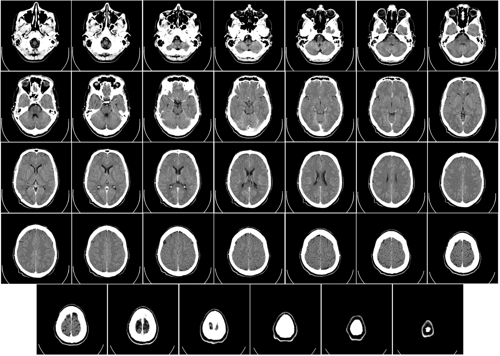
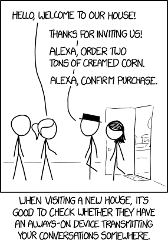
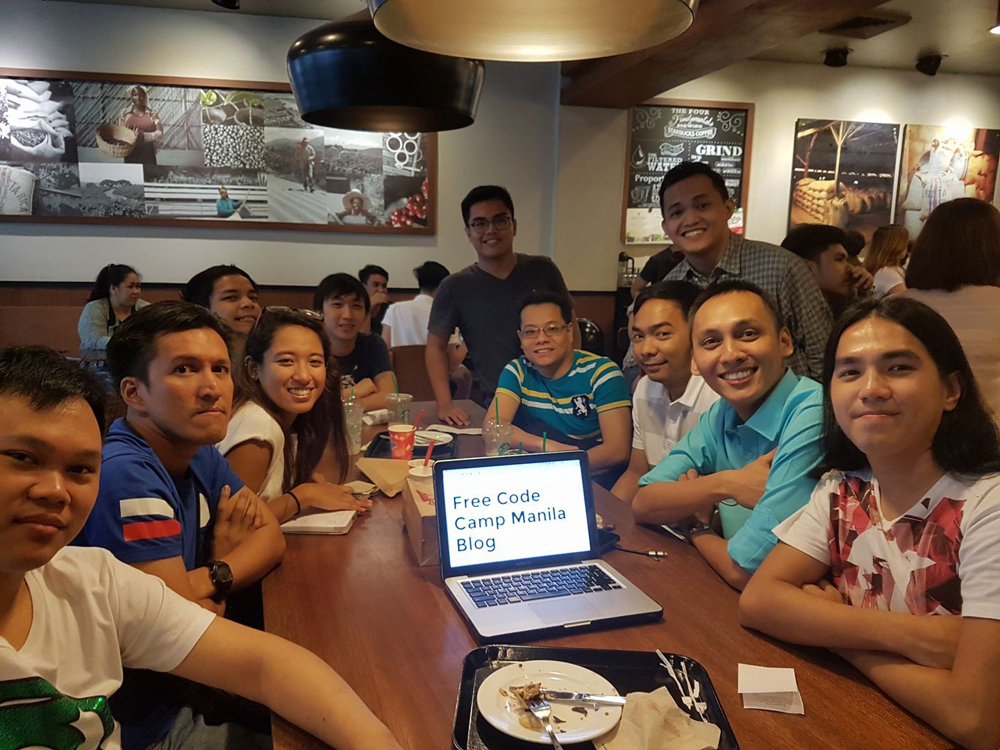

Here are three links worth your time:

1.  Google’s Deep Learning AI project diagnoses cancer faster than pathologists, and with 89% accuracy (versus 73% accuracy by the human doctor in the study) ([2 minute read](http://bit.ly/2lw3Rsd))
2.  No budget? No excuse. A practical guide to solid User Experience Design on the cheap ([10 minute read](http://bit.ly/2mMClqR))
3.  3D printing a tiny house using concrete, then wiring it up for living — all in 24 hours, and for about $10,000 ([7 minute watch](http://bit.ly/2n61qcc))

### Thought of the day:

> “Most people spend more time and energy going around problems than trying to solve them.” — Henry Ford

### Funny of the day:

Webcomic by [XKCD](http://bit.ly/2lw1khI)

### Study group of the day:

[freeCodeCamp Manila](http://bit.ly/2mWVMtO)

Happy coding!

– Quincy Larson, teacher at [freeCodeCamp](http://bit.ly/2j7Q1dN)
