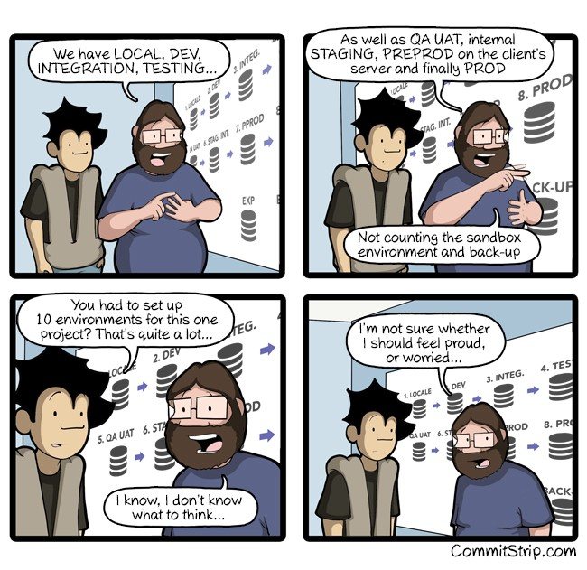

Here are three links worth your time:

1.  How Google builds web frameworks on top of 2 billion lines of code ([8 minute read](https://medium.freecodecamp.com/how-google-builds-a-web-framework-5eeddd691dea#.50wopfcvm))
2.  How to build cross-platform mobile apps using nothing more than a JSON markup ([9 minute read](http://bit.ly/2l7zxDv))
3.  I interviewed Bill Sourour — who’s worked as a software engineer for two decades — about keeping your skills relevant and avoiding burnout ([60 minute watch](http://bit.ly/2lbxE84))

### Thought of the day:

> “The Internet? Is that thing still around?” — Homer Simpson

### Funny of the day:

Web comic by [Commit Strip](http://www.commitstrip.com/en/2017/02/10/proud-or-worried/?)

### Study group of the day:

[freeCodeCamp Toronto](http://facebook.com/groups/free.code.camp.to)

Happy coding!

– Quincy Larson, teacher at [freeCodeCamp](http://bit.ly/2j7Q1dN)
