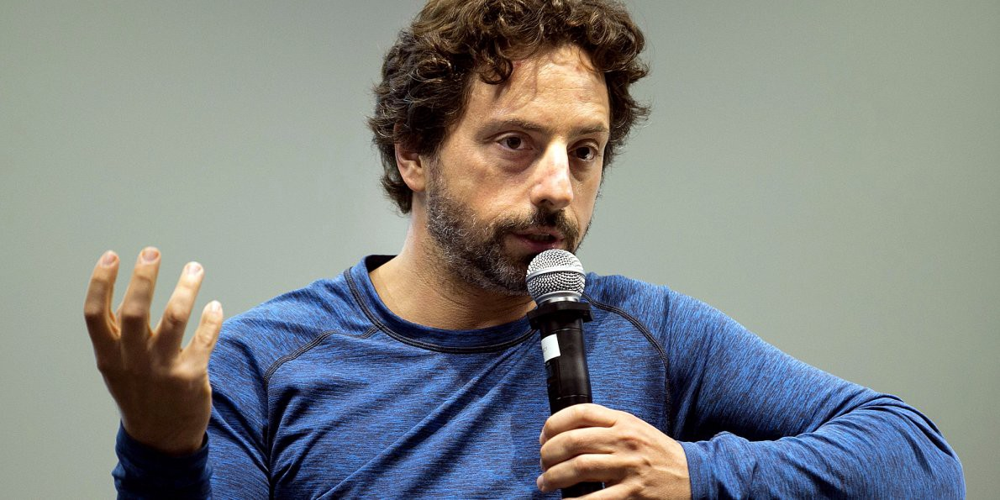
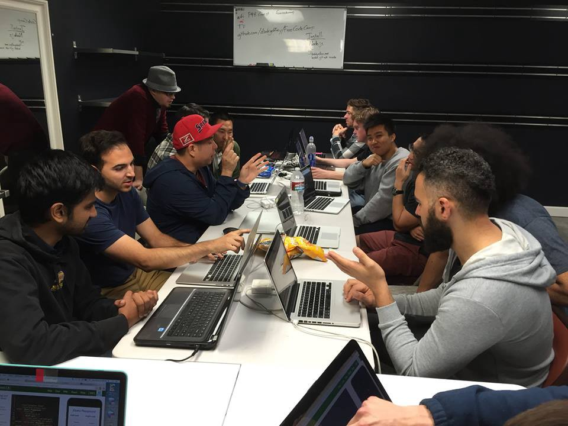

Here are three links worth your time:

1.  Google cofounder Sergey Brin talks about AI, automation, and the future of education ([34 minute watch](http://bit.ly/2lTKmdi))
2.  A brief history of random numbers ([8 minute read](http://bit.ly/2mjxZCw))
3.  Priest Willis interviews me about freeCodeCamp and the future of education ([40 minute listen](http://bit.ly/2mjoSTz))

### Thought of the day:

> “Everyone should have access to education. Primary education, secondary, university, and for that matter, post-graduate work. Those things are extraordinarily expensive today, but that’s an artifact of the infrastructure. We assume we need big buildings and fancy classrooms and things like that. I don’t think those are necessary. It’s fine to have those for some folks. But education should be universally accessible.” — Sergey Brin

### Funny of the day:

[Webcomic by XKCD](http://bit.ly/2n1jxDG)

### Study group of the day:

[freeCodeCamp Orange County](http://bit.ly/2ng6cYQ)

Happy coding!

– Quincy Larson, teacher at [freeCodeCamp](http://bit.ly/2j7Q1dN)
